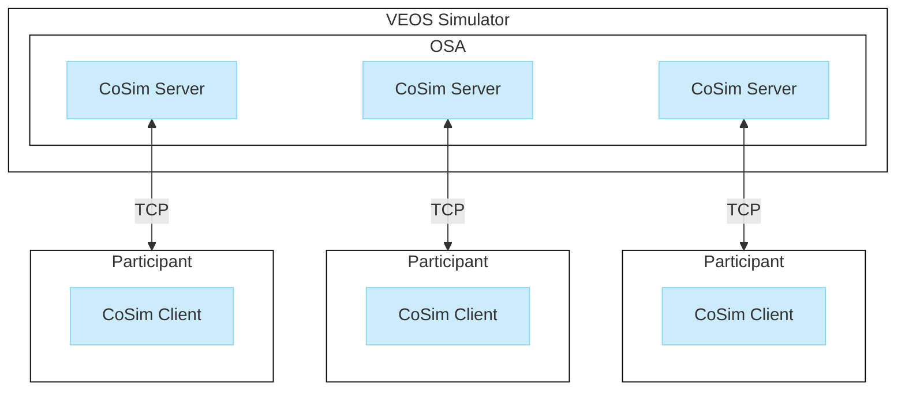

# Basics on Co-Simulation with VEOS

> [⬆️ Go to Basics on Co-Simulation](basics.md)

- [Basics on Co-Simulation with VEOS](#basics-on-co-simulation-with-veos)
  - [Introduction](#introduction)
  - [Co-simulation architecture](#co-simulation-architecture)
    - [CoSim server](#cosim-server)
    - [CoSim client](#cosim-client)
  - [Compatibility and licensing](#compatibility-and-licensing)
  - [Limitation](#limitation)

## Introduction

dSPACE provides the VEOS co-simulation interface for implementing co-simulations with VEOS. This lets you couple VEOS with domain-specific simulators,
such as data replay tools and sensor signal simulators.

The co-simulation interface enables the exchange of simulated CAN, LIN, and Ethernet bus messages as well as I/O signals.

## Co-simulation architecture

Co-simulation with VEOS is implemented in a client-server architecture, where the VEOS Simulator provides the overall simulation time for all co-simulation participants.

Each participant uses a co-simulation (CoSim) client to connect via TCP to a CoSim server that runs in the VEOS Simulator. Refer to the following illustration.

### CoSim server

A CoSim server provides the co-simulation interface for the VEOS Simulator.

Each CoSim server is generated from a JSON interface description file.

For more information, refer to [Basics on CoSim Servers](basics-servers.md).

### CoSim client

Each co-simulation participant uses a CoSim client to connect to one or more CoSim servers. The CoSim client is set up via C++ source code and CMake.
Alternatively, it can be set up as a dynamic library if you want to work with the co-simulation interface via Python, for example.

For more information, refer to [Basics on CoSim Clients](basics-clients.md).

## Compatibility and licensing

The VEOS co-simulation interface is compatible with VEOS 2023-B and later.

It requires the license for the VEOS - AAP (AUTOSAR Adaptive Platform) module.

The VEOS co-simulation client interface is licensed as Open Source under the permissive Apache 2.0 license.

## Limitation

You cannot access variables of a co-simulation with experiment software such as ControlDesk.
