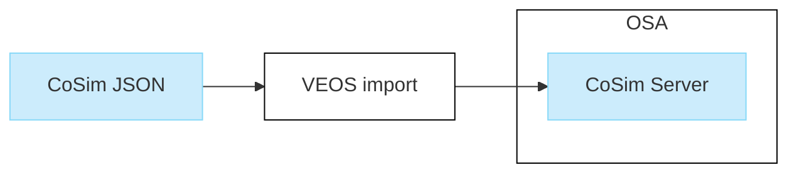

# Basics on CoSim Servers

> [⬆️ Go to Basics on Co-Simulation](basics.md)

- [Basics on CoSim Servers](#basics-on-cosim-servers)
  - [Introduction](#introduction)
  - [Configuring a CoSim server](#configuring-a-cosim-server)
    - [Specifying the TCP port](#specifying-the-tcp-port)
  - [Importing a CoSim JSON file](#importing-a-cosim-json-file)
    - [Connecting a CoSim server to other VPUs](#connecting-a-cosim-server-to-other-vpus)

## Introduction

A CoSim server provides the co-simulation interface of the VEOS Simulator that controls the simulation.

It is imported as a JSON interface description file into an offline simulation application in VEOS.

Refer to the following illustration.



## Configuring a CoSim server

To configure a CoSim server for a specific co-simulation client, you have to describe the co-simulation interface in a client-specific JSON description file.

The JSON file can provide the following information:

- General information, such as the time step interval for the co-simulation

- Bus controller information, such as the baud rate

- I/O signal information, such as data types of signals

The JSON schema for the CoSim interface is based on the `simulator-extension.base.schema.json` schema. You can find both schemas under `tools/schemas` in the installation directory of your VEOS installation.

### Specifying the TCP port

By default, the CoSim server provides a dynamic TCP port and a port mapper. The port mapper is automatically started by the first CoSim server in an OSA. For this use case, you do not have to explicitly specify a TCP port in the JSON interface description file.

However, for some use cases, you might want to specify a static TCP port. To do this, use the TcpPort property, i.e.,:

```json
"TcpPort": {
    "type": "number",
    "default": 12345,
    "minimum": 0,
    "maximum": 65535
}
```

> [!Note]
>
> When you specify a static TCP port, you have to provide this to the related client. Refer to [Connecting to a CoSim server](basics-clients.md#connecting-to-a-cosim-server).

Each VEOS CoSim server starts its own TCP server at the TCP port specified in the JSON file and registers this port with the port mapper.

The default TCP port of the port mapper is 27027. You can reconfigure it using the `VEOS_COSIM_PORTMAPPER_PORT` environment variable. You have to do this for the CoSim servers and the CoSim clients.

For CoSim servers, you have to set the environment variable before starting the VEOS Kernel.

## Importing a CoSim JSON file

You can import a CoSim JSON into any OSA using the VEOS Player (only on Windows) or the VEOS Model Console (on Windows and Linux).

The following listing shows an example of using the VEOS Model Console on Linux to import the `CosimServer.json` description file into the newly created `CoSimOsa.osa` in the current working directory.

```console
/opt/dspace/veos2023b/bin/veos model import -n ./CoSimOsa.osa -p ./CoSimServer.json
```

For a working example, refer to [How to Prepare the CoSim Demo](../tutorial/prepare.md).

### Connecting a CoSim server to other VPUs

To connect the I/O signals and controllers of the CoSim server to other VPUs in the same OSA, you can use drag & drop in the VEOS Player (only on Windows) or the VEOS Model Console (on Windows and Linux).

In many cases, you can also use the auto-connect functionality of VEOS. You can find an example of this in the CoSim demo. Refer to [Step 4: Using Data Callback Functions to Get Information on CAN Bus Messages](../tutorial/step4-callback.md).
