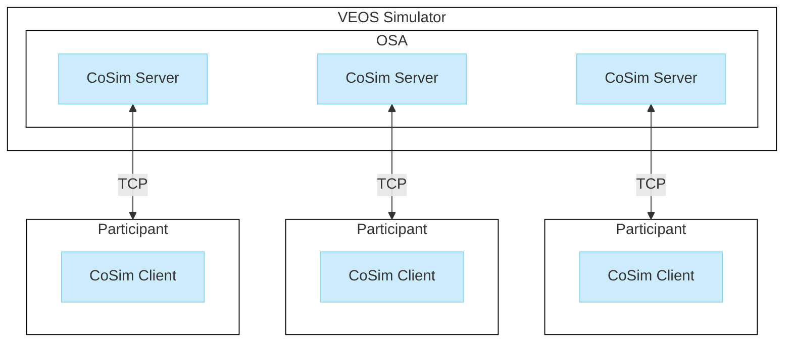
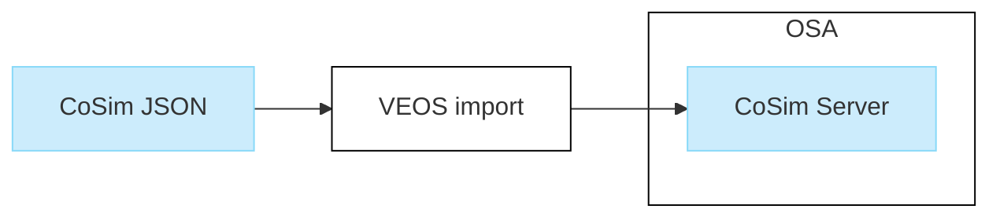

# Table of Contents

- [Basics on Co-Simulation](#basics-on-co-simulation)
  - [Basics on Co-Simulation with VEOS](#basics-on-co-simulation-with-veos)
  - [Basics on CoSim Servers](#basics-on-cosim-servers)
  - [Basics on CoSim Clients](#basics-on-cosim-clients)
- [Working with the VEOS CoSim Demo](#working-with-the-veos-cosim-demo)
  - [Overview of the VEOS CoSim Demo](#overview-of-the-veos-cosim-demo)
  - [How to Prepare the CoSim Demo](#how-to-prepare-the-cosim-demo)
  - [Example: Setting Up a Basic Co-Simulation](#example-setting-up-a-basic-co-simulation)
  - [Example: Implementing Simulation State Change Callbacks](#example-implementing-simulation-state-change-callbacks)
  - [Example: Accessing the Data Interface](#example-accessing-the-data-interface)
  - [Example: Using Data Callback Functions to Get Information on CAN Bus Messages](#example-using-data-callback-functions-to-get-information-on-can-bus-messages)
  - [Example: Sending Data](#example-sending-data)
  - [Example: Receiving Data](#example-receiving-data)
  - [Example: Running a Polling-Based Simulation](#example-running-a-polling-based-simulation)
  - [Example: Handling I/O Signals](#example-handling-io-signals)
  - [Example: Optional Client](#example-optional-client)
- [DsVeosCoSim Client API Reference](#dsveoscosim-client-api-reference)
  - [Enumerations](#enumerations)
    - [DsVeosCoSim_CanMessageFlags](#dsveoscosim_canmessageflags-enumeration)
    - [DsVeosCoSim_Command](#dsveoscosim_command-enumeration)
    - [DsVeosCoSim_ConnectionState](#dsveoscosim_connectionstate-enumeration)
    - [DsVeosCoSim_DataType](#dsveoscosim_datatype-enumeration)
    - [DsVeosCoSim_EthMessageFlags](#dsveoscosim_ethmessageflags-enumeration)
    - [DsVeosCoSim_LinControllerType](#dsveoscosim_lincontrollertype-enumeration)
    - [DsVeosCoSim_LinMessageFlags](#dsveoscosim_linmessageflags-enumeration)
    - [DsVeosCoSim_Result](#dsveoscosim_result-enumeration)
    - [DsVeosCoSim_Severity](#dsveoscosim_severity-enumeration)
    - [DsVeosCoSim_SizeKind](#dsveoscosim_sizekind-enumeration)
    - [DsVeosCoSim_TerminateReason](#dsveoscosim_terminatereason-enumeration)
  - [Functions](#functions)
    - [DsVeosCoSim_CanMessageReceivedCallback](#dsveoscosim_canmessagereceivedcallback-function-pointer)
    - [DsVeosCoSim_Connect](#dsveoscosim_connect-function)
    - [DsVeosCoSim_Destroy](#dsveoscosim_destroy-function)
    - [DsVeosCoSim_Disconnect](#dsveoscosim_disconnect-function)
    - [DsVeosCoSim_EthMessageReceivedCallback](#dsveoscosim_ethmessagereceivedcallback-function-pointer)
    - [DsVeosCoSim_FinishCommand](#dsveoscosim_finishcommand-function)
    - [DsVeosCoSim_GetCanControllers](#dsveoscosim_getcancontrollers-function)
    - [DsVeosCoSim_GetConnectionState](#dsveoscosim_getconnectionstate-function)
    - [DsVeosCoSim_GetEthControllers](#dsveoscosim_getethcontrollers-function)
    - [DsVeosCoSim_GetIncomingSignals](#dsveoscosim_getincomingsignals-function)
    - [DsVeosCoSim_GetLinControllers](#dsveoscosim_getlincontrollers-function)
    - [DsVeosCoSim_GetOutgoingSignals](#dsveoscosim_getoutgoingsignals-function)
    - [DsVeosCoSim_IncomingSignalChangedCallback](#dsveoscosim_incomingsignalchangedcallback-function-pointer)
    - [DsVeosCoSim_LinMessageReceivedCallback](#dsveoscosim_linmessagereceivedcallback-function-pointer)
    - [DsVeosCoSim_LogCallback](#dsveoscosim_logcallback-function-pointer)
    - [DsVeosCoSim_PollCommand](#dsveoscosim_pollcommand-function)
    - [DsVeosCoSim_ReadIncomingSignal](#dsveoscosim_readincomingsignal-function)
    - [DsVeosCoSim_ReceiveCanMessage](#dsveoscosim_receivecanmessage-function)
    - [DsVeosCoSim_ReceiveEthMessage](#dsveoscosim_receiveethmessage-function)
    - [DsVeosCoSim_ReceiveLinMessage](#dsveoscosim_receivelinmessage-function)
    - [DsVeosCoSim_RunCallbackBasedCoSimulation](#dsveoscosim_runcallbackbasedcosimulation-function)
    - [DsVeosCoSim_SetCallbacks](#dsveoscosim_setcallbacks-function)
    - [DsVeosCoSim_SetLogCallback](#dsveoscosim_setlogcallback-function)
    - [DsVeosCoSim_SetNextSimulationTime](#dsveoscosim_setnextsimulationtime-function)
    - [DsVeosCoSim_SimulationCallback](#dsveoscosim_simulationcallback-function-pointer)
    - [DsVeosCoSim_SimulationTerminatedCallback](#dsveoscosim_simulationterminatedcallback-function-pointer)
    - [DsVeosCoSim_StartPollingBasedCoSimulation](#dsveoscosim_startpollingbasedcosimulation-function)
    - [DsVeosCoSim_TransmitCanMessage](#dsveoscosim_transmitcanmessage-function)
    - [DsVeosCoSim_TransmitEthMessage](#dsveoscosim_transmitethmessage-function)
    - [DsVeosCoSim_TransmitLinMessage](#dsveoscosim_transmitlinmessage-function)
    - [DsVeosCoSim_WriteOutgoingSignal](#dsveoscosim_writeoutgoingsignal-function)
  - [Structures](#structures)
    - [DsVeosCoSim_Callbacks](#dsveoscosim_callbacks-structure)
    - [DsVeosCoSim_CanController](#dsveoscosim_cancontroller-structure)
    - [DsVeosCoSim_CanMessage](#dsveoscosim_canmessage-structure)
    - [DsVeosCoSim_ConnectConfig](#dsveoscosim_connectconfig-structure)
    - [DsVeosCoSim_EthController](#dsveoscosim_ethcontroller-structure)
    - [DsVeosCoSim_EthMessage](#dsveoscosim_ethmessage-structure)
    - [DsVeosCoSim_IoSignal](#dsveoscosim_iosignal-structure)
    - [DsVeosCoSim_LinController](#dsveoscosim_lincontroller-structure)
    - [DsVeosCoSim_LinMessage](#dsveoscosim_linmessage-structure)
  - [Simple Types](#simple-types)
    - [DsVeosCoSim_BusControllerId](#dsveoscosim_buscontrollerid-type)
    - [DsVeosCoSim_Handle](#dsveoscosim_handle-type)
    - [DsVeosCoSim_IoSignalId](#dsveoscosim_iosignalid-type)
    - [DsVeosCoSim_SimulationTime](#dsveoscosim_simulationtime-type)
  - [Macros](#macros)

# Basics on Co-Simulation

## Basics on Co-Simulation with VEOS

### Introduction

dSPACE provides the VEOS co-simulation interface for implementing co-simulations with VEOS. This lets you couple VEOS with domain-specific simulators,
such as data replay tools and sensor signal simulators.

The co-simulation interface enables the exchange of simulated CAN, LIN, and Ethernet bus messages as well as I/O signals.

### Co-simulation architecture

Co-simulation with VEOS is implemented in a client-server architecture, where the VEOS Simulator provides the overall simulation time for all co-simulation participants.

Each participant uses a co-simulation (CoSim) client to connect via TCP to a CoSim server that runs in the VEOS Simulator. Refer to the following illustration.



**CoSim server**
A CoSim server provides the co-simulation interface for the VEOS Simulator.

Each CoSim server is generated from a JSON interface description file.

For more information, refer to [Basics on CoSim Servers](#basics-on-cosim-servers).

**CoSim client**
Each co-simulation participant uses a CoSim client to connect to one or more CoSim servers. The CoSim client is set up via C++ source code and CMake.
Alternatively, it can be set up as a dynamic library if you want to work with the co-simulation interface via Python, for example.

For more information, refer to [Basics on CoSim Clients](#basics-on-cosim-clients).

### Compatibility and licensing

The VEOS co-simulation interface is compatible with VEOS 2023-B and later.

It requires the license for the VEOS - AAP (AUTOSAR Adaptive Platform) module.

The VEOS co-simulation client interface is licensed as Open Source under the permissive Apache 2.0 license.

### Limitation

You cannot access variables of a co-simulation with experiment software such as ControlDesk.

## Basics on CoSim Servers

### Introduction

A CoSim server provides the co-simulation interface of the VEOS Simulator that controls the simulation.

It is imported as a JSON interface description file into an offline simulation application in VEOS.

Refer to the following illustration.



### Configuring a CoSim server

To configure a CoSim server for a specific co-simulation client, you have to describe the co-simulation interface in a client-specific JSON description file.

The JSON file can provide the following information:

- General information, such as the time step interval for the co-simulation

- Bus controller information, such as the baud rate

- I/O signal information, such as data types of signals

The JSON schema for the CoSim interface is based on the ```simulator-extension.base.schema.json``` schema. You can find both schemas under ```tools/schemas``` in the installation directory of your VEOS installation.

**Specifying the TCP port**
By default, the CoSim server provides a dynamic TCP port and a port mapper. The port mapper is automatically started by the first CoSim server in an OSA. For this use case, you do not have to explicitly specify a TCP port in the JSON interface description file.

However, for some use cases, you might want to specify a static TCP port. To do this, use the TcpPort property, i.e.,:

```json
"TcpPort": {
    "type": "number",
    "default": 12345,
    "minimum": 0,
    "maximum": 65535
}
```

> **Note**
>
> When you specify a static TCP port, you have to provide this to the related client. Refer to [Connecting to a CoSim server](#connecting-to-a-cosim-server).

Each VeosCoSim server starts its own TCP server at the TCP port specified in the JSON file and registers this port with the port mapper.

The default TCP port of the port mapper is 27027. You can reconfigure it using the ```VEOS_COSIM_PORTMAPPER_PORT``` environment variable. You have to do this for the CoSim servers and the CoSim clients.

For CoSim servers, you have to set the environment variable before starting the VEOS Kernel.

### Importing a CoSim JSON file

You can import a CoSim JSON into any OSA using the VEOS Player (only on Windows) or the VEOS Model Console (on Windows and Linux).

The following listing shows an example of using the VEOS Model Console on Linux to import the ```CosimServer.json``` description file into the newly created ```CoSimOsa.osa``` in the current working directory.

```console
/opt/dspace/veos2023b/bin/veos model import -n ./CoSimOsa.osa -p ./CoSimServer.json
```

For a working example, refer to [How to Prepare the CoSim Demo](#how-to-prepare-the-cosim-demo).

**Connecting a CoSim server to other VPUs**
To connect the I/O signals and controllers of the CoSim server to other VPUs in the same OSA, you can use drag & drop in the VEOS Player (only on Windows) or the VEOS Model Console (on Windows and Linux).

In many cases, you can also use the auto-connect functionality of VEOS. You can find an example of this in the CoSim demo. Refer to [Example: Using Data Callback Functions to Get Information on CAN Bus Messages](#example-using-data-callback-functions-to-get-information-on-can-bus-messages).

## Basics on CoSim Clients

### Introduction

You have to implement a CoSim client in C++ code that uses the CoSim API to interact with the CoSim server.

You can then integrate the client as a submodule in the project containing your binary (recommended) or precompile the CoSim sources as a static library to link it to your binary.

If you want to access the co-simulation interface via Python, you can also precompile the client sources as a dynamic library.

### Workflow

The following steps outline the workflow for creating a CoSim client:

1. Download the latest ```veos-cosim-client-<version>.zip``` archive from [veos-cosim-client](https://github.com/dspace-group/veos-cosim-client) and extract it to a dedicated folder, e.g., ```DsVeosCoSim/ThirdParty/veos-cosim-client``` in your home directory.

2. Depending on your use case, take the following steps:

   - For including the client as a submodule in your project, refer to Example: Setting Up a Basic Co-Simulation.

   - For precompiling as a dynamic library, execute the following commands in the folder to which you extracted the DsVeosCoSim.zip archive:

     ```console
     mkdir Debug
     cd Debug
     cmake .. -DBUILD_SHARED_LIBS=ON
     cmake --build . --config=Debug
     ```

     This produces a dynamic library file in the Src/Debug subdirectory.

     Replace Debug with Release in the listing above to create a release version.

   - For precompiling as a static library, execute the following commands in the folder to which you extracted the DsVeosCoSim.zip archive:

     ```console
     mkdir Debug
     cd Debug
     cmake ..
     cmake --build . --config Debug
     cmake --install . --config Debug --prefix ../install
     ```

     This produces a static library file in the install subdirectory.

     Replace Debug with Release in the listing above to create a release version.

### Connecting to a CoSim server

By default, a CoSim client asks the CoSim port mapper for the actual TCP port of the related CoSim server and then connects to this port. For this to work, you have to specify the server name via [DsVeosCoSim_ConnectConfig.serverName](#dsveoscosim_connectconfig-structure).

However, if you specified a static TCP port for the CoSim server, you have to explicitly connect to this port by providing it via [DsVeosCoSim_ConnectConfig.remotePort](#dsveoscosim_connectconfig-structure) in the implementation of your client.

If you specify both ```serverName``` and ```remotePort```, ```remotePort``` is used to establish the connection.

If the server is running on a different host, you must specify the IP address using [DsVeosCoSim_ConnectConfig.remoteIpAddress](#dsveoscosim_connectconfig-structure).

The local port is also created dynamically by default. For special cases like creating a tunnel between client and server, you can overwrite this with a specific port using [DsVeosCoSim_ConnectConfig.localPort](#dsveoscosim_connectconfig-structure).

> **Tip**
>
> You can use [DsVeosCoSim_ConnectConfig.clientName](#dsveoscosim_connectconfig-structure) to provide a name for the client that can be used in VEOS messages for better readability. For example, if you set ```DsVeosCoSim_ConnectConfig.clientName = "CustomClient"```, a message might look like this: ```dSPACE VEOS CoSim client 'CustomClient' at 127.0.0.1:56248 connected.```.

### Callback-based vs. polling-based co-simulation

You can configure the CoSim client for two different co-simulation modes:

- Callback-based: This is a blocking simulation which only stops when the client is disconnected from the server. While it is running, the registered callbacks are processed for each simulation step.

  During each callback, VEOS does not advance the simulation until the callback is finished.

  In the absence of errors, a callback-based co-simulation only returns when the client is disconnected from the server.

  For a basic example, refer to [Example: Setting Up a Basic Co-Simulation](#example-setting-up-a-basic-co-simulation).

- Polling-based: The simulation polls for commands and performs the actions that are specified in the implementation for each command. This can also include callbacks, which are received in the same order as for a callback-based co-simulation.

  This mode can be useful in cases where the CoSim server has to communicate with another API that is callback-based so you do not have to take care of synchronizing the callbacks.

  For an example of implementing a polling-based co-simulation, refer to [Example: Running a Polling-Based Simulation](#example-running-a-polling-based-simulation).

  > **Note**
  >
  > Once one of these modi is selected, it cannot be changed until the client is disconnected from the server.

### Basics on callbacks

You can use callback functions to get information on state changes of the simulation and on data exchange:

- State changes: Started, stopped, paused, continued, terminated

- Steps: begin and end step

- Bus message received: CAN, Ethernet, LIN

- I/O signal changed (for incoming signals)

Callbacks are optional. However, not registering any callbacks makes sense only for polling-based simulations.

Each time the server notifies the client of a new step, the callbacks are received in the following order:

- Begin step

- Bus message and I/O signal callbacks in no specific order

- End step

### Basics on timing

Each time VEOS receives the simulation start or continue command, the server begins to send steps to the client and stops when a simulation stop, pause, or terminate command is received.

The first step always takes place at simulation time 0. After that, the simulation is advanced by a step after each time interval specified in the StepSize property in the CoSim server JSON file.

The client can intervene via the [DsVeosCoSim_SetNextSimulationTime Function](#dsveoscosim_setnextsimulationtime-function), which specifies the condition for the server to send the next step. This can be done for each step or just from time to time. Once the server no longer receives this condition, it proceeds with the predefined step size. If the time specified via the [DsVeosCoSim_SetNextSimulationTime Function](#dsveoscosim_setnextsimulationtime-function) is in the past or equal to the present time, it is ignored.

If no step size is specified in the JSON file, the server sends only one step at simulation time 0. The simulation is only advanced if the client executes the [DsVeosCoSim_SetNextSimulationTime Function](#dsveoscosim_setnextsimulationtime-function). Otherwise, the simulation in VEOS continues without the co-simulator.

Bus messages and I/O signals are always sent between server and client in the context of a step.

# Working with the VEOS CoSim Demo

## Overview of the VEOS CoSim Demo

### Introduction

The VEOS CoSim demo provides instructions for setting up a simple example CoSim server and implementing several kinds of CoSim clients to illustrate the basic co-simulation functionalities.

### Workflow

The VEOS CoSim demo leads you through the following steps:

- Create a simple JSON interface description file for a CoSim server

- Create an OSA in VEOS, import the JSON file, and load it to the simulator

- Implement a basic CoSim client and start a co-simulation

- Modify the basic CoSim client to familiarize yourself with the principal aspects of co-simulation

### Overview of the examples

Before starting with any of the examples listed below, you must make the preparations described in [How to Prepare the CoSim Demo](#how-to-prepare-the-cosim-demo).

Example | What It Shows | Refer to
---|---|---
Basic co-simulation | Enable basic logging | [Example: Setting Up a Basic Co-Simulation](#example-setting-up-a-basic-co-simulation)
Implementing simulation state change callbacks | Tracking simulation state changes | [Example: Implementing Simulation State Change Callbacks](#example-implementing-simulation-state-change-callbacks)
Accessing the data interface | Getting information on available bus controllers and I/O signals | [Example: Accessing the Data Interface](#example-accessing-the-data-interface)
Using data callbacks | Getting information on newly received bus messages | [Example: Using Data Callback Functions to Get Information on CAN Bus Messages](#example-using-data-callback-functions-to-get-information-on-can-bus-messages)
Sending data | Sending data to VEOS | [Example: Sending Data](#example-sending-data)
Receiving data | Receiving data from VEOS | [Example: Receiving Data](#example-receiving-data)
Running a polling-based co-simulation | Running a polling-based co-simulation | [Example: Running a Polling-Based Simulation](#example-running-a-polling-based-simulation)
Handling I/O signals | Handling I/O signal communication for two client-server pairs. | [Example: Handling I/O Signals](#example-handling-io-signals)
Optional clients | Simulation behavior for a CoSim server for which a client is optional. | [Example: Optional Client](#example-optional-client)

### Requirements

You can work with the demo on Windows and Ubuntu 20.04 LTS.

Additionally, you must have the following:

- CMake 3.13 or higher

- Either of the following compilers:

  - GCC 10 or higher

  - MSVC 2022 or higher

  - Clang 10 or higher

## How to Prepare the CoSim Demo

### Objective

To prepare the CoSim demo by performing the following tasks:

1. Setting up the CoSim example server. Refer to Part 1.

2. Setting up a CoSim test client. Refer to Part 2.

### Part 1: To set up the CoSim example server

1. Create the DsVeosCoSimDemo directory in a directory of your choice.

2. In the DsVeosCoSimDemo directory, create a JSON file with the following content, where you have to replace "file:///DsVeosCoSim.schema.json" with the path where the VEOS CoSim JSON schema of your VEOS installation is saved. This defaults to "file:///C:/Program Files/dSPACE VEOS 2023‑B/tools/schemas/DsVeosCoSim.schema.json" on Windows and "file:///opt/dspace/veos2023b/tools/schemas/DsVeosCoSim.schema.json" on Linux.

   ```json
   {
     "$schema": "file:///DsVeosCoSim.schema.json",
     "Type": "DsVeosCoSim",
     "Name": "CoSimExample",
     "StepSize": 0.001,
     "Network": {
       "CAN": {
         "CanController": {
           "ClusterName": "HighSpeedCanCluster",
           "BitsPerSecond": 500000,
           "FlexibleDataRateBitsPerSecond": 2000000
         }
       }
     },
     "IOSignals": {
       "Outgoing": [
         {
           "Name": "Signal1",
           "DataType": "float64",
           "PortName": "Port1"
         }
       ]
     }
   }
   ```

3. Save the JSON file under the file name Example.json.

4. In VEOS, create a new OSA and import the JSON file into it:

   - On Windows, you can use VEOS Player:

     Click **Home** - **New** to create a new OSA. Import the JSON file via drag & drop. When the import is finished, press **F12** to save the OSA under a name of your choice.

     Alternatively, you can use the VEOS Model Console like this:

     ```console
     <VEOS installation directory>/bin/veos.exe model import -n ./VeosCoSimOsa.osa -p ./Example.json
     ```

   - On Linux:

     ```console
     /opt/dspace/veos2023b/bin/veos model import \-n ./VeosCoSimOsa.osa -p ./Example.json
     ```

5. Load the OSA to the simulator:

   - On Windows, click Simulation - Load or use the VEOS Simulator Console in the command-line:

     ```console
     <VEOS installation directory>/bin/veos.exe sim load ./VeosCoSimOsa.osa
     ```

   - On Linux:

     ```console
     /opt/dspace/veos2023b/bin/veos sim load ./VeosCoSimOsa.osa
     ```

### Interim result

You created a JSON interface description file for a CoSim server, created an OSA in VEOS, imported the JSON file into the OSA, and loaded it to the simulator.

The CoSim server waits for a client to connect.

### Part 2: To set up a CoSim test client

1. Download the latest ```veos-cosim-client-<version>.zip``` archive from [veos-cosim-client](https://github.com/dspacegroup/veos-cosim-client).

2. Create the ```ThirdParty/veos-cosim-client``` subdirectory in the DsVeosCoSimDemo directory and extract the ZIP archive to this subfolder.

3. In the DsVeosCoSimDemo directory, create the ```CMakeLists.txt``` file with the following content:

   ```cmake
   cmake_minimum_required(VERSION 3.13)

   project(DsVeosCoSimDemo VERSION 1.0)

   set(CMAKE_CXX_STANDARD 20)
   set(CMAKE_CXX_STANDARD_REQUIRED TRUE)

   add_subdirectory(ThirdParty/veos-cosim-client)

   add_executable(${PROJECT_NAME} main.cpp)
   target_link_libraries(${PROJECT_NAME} PRIVATE DsVeosCoSim)
   ```

4. Also in the DsVeosCoSimDemo directory, create the main.cpp file with the following content:

   ```cpp
   #include <iomanip>
   #include <iostream>
   #include <sstream>

   #include "DsVeosCoSim/DsVeosCoSim.h"

   int main() {
       return 0;
   }
   ```

5. In the DsVeosCoSimDemo directory, run the following commands to create a build directory, configure the build project, and compile the test executable:

   ```console
   mkdir build
   cd build
   cmake ..
   cmake --build .
   ```

   > **Note**
   >
   > If you use Visual Studio on Windows, make sure to run these commands in the Visual Studio Developer Command Prompt.

6. Test the executable by running the following command in the build subdirectory:

   - On Windows:

     ```console
     .\Debug\DsVeosCoSimDemo.exe
     ```

   - On Linux:

     ```console
     ./Debug/DsVeosCoSimDemo
     ```

   The executable simply returns without any message.

### Result

You set up a basic CoSim server in VEOS and set up a build project for CoSim clients. You also created a simple test executable to confirm the build project was configured correctly.

### Next steps

You can now proceed to build a simple example CoSim client and use it in a co-simulation with the CoSim server you set up in Part 1.

Refer to [Example: Setting Up a Basic Co-Simulation](#example-setting-up-a-basic-co-simulation).

## Example: Setting Up a Basic Co-Simulation

### Introduction

This example shows how to create a basic CoSim client which connects to the CoSim server in VEOS and reports on its progress via log callbacks.

### Precondition

You must have made the preparations described in [How to Prepare the CoSim Demo](#how-to-prepare-the-cosim-demo).

### How to set up the client

1. Replace the content of `main.cpp` with the following code and save it:

    ```cpp
    #include <iomanip>
    #include <iostream>
    #include <sstream>

    #include "DsVeosCoSim/DsVeosCoSim.h"

    void OnLogCallback(DsVeosCoSim_Severity severity, const char* logMessage) {
        switch (severity) {
            case DsVeosCoSim_Severity_Error:
                std::cout << "ERROR " << logMessage << "\n";
                break;
            case DsVeosCoSim_Severity_Warning:
                std::cout << "WARN  " << logMessage << "\n";
                break;
            case DsVeosCoSim_Severity_Info:
                std::cout << "INFO  " << logMessage << "\n";
                break;
            case DsVeosCoSim_Severity_Trace:
                std::cout << "TRACE " << logMessage << "\n";
                break;
        }
    }

    // Called after every interval specified in the StepSize parameter of the Example.json file
    void OnEndStep(DsVeosCoSim_SimulationTime simulationTime, void* userData) {
        std::cout << "Step callback received at " << DSVEOSCOSIM_SIMULATION_TIME_TO_SECONDS(simulationTime) << " s.\n";
    }

    int main() {
        // Step 1: Enable logging
        DsVeosCoSim_SetLogCallback(OnLogCallback);

        // Step 2: Create a handle for the client
        DsVeosCoSim_Handle handle = DsVeosCoSim_Create();
        if (handle == nullptr) {
            return 1;
        }

        // Step 3: Connect to the Example server that is running in VEOS
        DsVeosCoSim_ConnectConfig connectConfig{};
        connectConfig.serverName = "CoSimExample";
        if (DsVeosCoSim_Connect(handle, connectConfig) != DsVeosCoSim_Result_Ok) {
            DsVeosCoSim_Destroy(handle);
            return 1;
        }

        // Step 4: Run a callback-based co-simulation
        DsVeosCoSim_Callbacks callbacks{};
        callbacks.simulationEndStepCallback = OnEndStep;
        callbacks.userData = handle; // Pass the handle to every callback
        if (DsVeosCoSim_RunCallbackBasedCoSimulation(handle, callbacks) != DsVeosCoSim_Result_Disconnected) {
            DsVeosCoSim_Disconnect(handle);
            DsVeosCoSim_Destroy(handle);
        }

        DsVeosCoSim_Destroy(handle);
        return 0; 
    }
    ```

2. In the build directory, call `cmake --build .` to build the executable.

### What it does

- The `OnLogCallback` function prints log messages corresponding to the severity level. It is registered by the
  [DsVeosCoSim_SetLogCallback Function](#dsveoscosim_setlogcallback-function) in `Step 1`.

- In `Step 2`, a handle for the client is created which is used by all the other functions.

  Only one handle can be connected to one CoSim server in the VEOS simulator. However, a client can create multiple handles and connect them to other CoSim
  servers on the same or other VEOS simulators.

- In `Step 3`, a connection to the Example server running in VEOS is established via the [DsVeosCoSim_Connect Function](#dsveoscosim_connect-function).

  **Tip:**
  - The client can also connect to a server that is running on a different computer. In this case, you have to add
    `connectConfig.remoteIpAddress = "<IP address>";`.

  - The Example server uses a dynamic TCP port and a port mapper. However, if you specified a static TCP port, you have to provide this to the client via
    `DsVeosCoSim_ConnectConfig.remotePort`. For more information, refer to [Connecting to a CoSim server](#connecting-to-a-cosim-server).

- In `Step 4` a callback-based co-simulation is started. The [DsVeosCoSim_RunCallbackBasedCoSimulation Function](#dsveoscosim_runcallbackbasedcosimulation-function) blocks
  until either [DsVeosCoSim_Disconnect Function](#dsveoscosim_disconnect-function) is called by a callback function or the simulation is unloaded in VEOS. Therefore, the
  expected return value is [DsVeosCoSim_Result_Disconnected](#dsveoscosim_result-enumeration) instead of [DsVeosCoSim_Result_Ok](#dsveoscosim_result-enumeration).

  In this example, the `simulationEndStepCallback` is called at the end of each simulation step and prints the corresponding simulation time in seconds as
  specified in the OnEndStep function definition.

  **Tip:**
  You can also run polling-based co-simulations. Refer to [Example: Running a Polling-Based Simulation](#example-running-a-polling-based-simulation) for an example.

### Running the co-simulation

1. Load the VeosCoSim.osa you created in [How to Prepare the CoSim Demo](#how-to-prepare-the-cosim-demo) to the VEOS simulator.

2. From the `DsVeosCoSimDemo/build` subdirectory, run the executable you built in How to set up the client via

    ```console
    .\Debug\DsVeosCoSimDemo.exe
    ```

    on Windows or

    ```console
    ./Debug/DsVeosCoSimDemo
    ```

    on Linux.

3. Start the simulation in VEOS:

    - On Windows, click **Simulation** - **Start** in the VEOS Player or use the VEOS Simulator Console in the command-line:

        ```console
        <VEOS installation directory>/bin/veos.exe sim start
        ```

    - On Linux:

        ```console
        /opt/dspace/veos2023b/bin/veos sim start
        ```

### Client output

The following listing shows the output produced by the client:

```console
INFO  Obtaining TCP port of dSPACE VEOS CoSim server 'CoSimExample' at 127.0.0.1 ...
INFO  Connecting to dSPACE VEOS CoSim server 'CoSimExample' at 127.0.0.1:50212 ...
INFO  Connected to dSPACE VEOS CoSim server 'CoSimExample' at 127.0.0.1:50212.
Step callback received at 0 s.
Step callback received at 0.001 s.
Step callback received at 0.002 s.
Step callback received at 0.003 s.
...
```

## Example: Implementing Simulation State Change Callbacks

### Introduction

This example shows how to implement simulation state change callbacks in a CoSim client.

### Preconditions

- You must have made the preparations described in [How to Prepare the CoSim Demo](#how-to-prepare-the-cosim-demo).

- You must have created the basic CoSim client described in [Example: Setting Up a Basic Co-Simulation](#example-setting-up-a-basic-co-simulation).

### How to set up the client

1. In the `main.cpp` code, replace the OnEndStep function definition starting in line `22` with the following code:

    ```cpp
    void OnEndStep(DsVeosCoSim_SimulationTime simulationTime, void* userData) {
        // Disable output for each step to make the messages more readable
        // std::cout << "Step callback received at " << DSVEOSCOSIM_SIMULATION_TIME_TO_SECONDS(simulationTime) << " s.\n";
    }

    // Called when the simulation starts
    void OnStarted(DsVeosCoSim_SimulationTime simulationTime, void* userData) {
        std::cout << "Simulation started at " << DSVEOSCOSIM_SIMULATION_TIME_TO_SECONDS(simulationTime) << " s.\n";
    }

    // Called when the simulation stops
    void OnStopped(DsVeosCoSim_SimulationTime simulationTime, void* userData) {
        std::cout << "Simulation stopped at " << DSVEOSCOSIM_SIMULATION_TIME_TO_SECONDS(simulationTime) << " s.\n";
    }

    // Called when the simulation pauses
    void OnPaused(DsVeosCoSim_SimulationTime simulationTime, void* userData) {
        std::cout << "Simulation paused at " << DSVEOSCOSIM_SIMULATION_TIME_TO_SECONDS(simulationTime) << " s.\n";
    }

    // Called when the simulation continues
    void OnContinued(DsVeosCoSim_SimulationTime simulationTime, void* userData) {
        std::cout << "Simulation continued at " << DSVEOSCOSIM_SIMULATION_TIME_TO_SECONDS(simulationTime) << " s.\n";
    }
    ```

2. In the `main` function definition, add the following callbacks below line `46` of the original listing:

    ```cpp
    callbacks.simulationStartedCallback = OnStarted;
    callbacks.simulationStoppedCallback = OnStopped;
    callbacks.simulationPausedCallback = OnPaused;
    callbacks.simulationContinuedCallback = OnContinued;
    ```

3. Save the `main.cpp` file and call `cmake --build .` to build the executable.

### What it does

The additional callback functions are called each time the simulation state changes and print corresponding messages.

### Running the co-simulation

1. Load the `DsVeosCoSim.osa` you created in [How to Prepare the CoSim Demo](#how-to-prepare-the-cosim-demo) to the VEOS simulator.

2. From the `DsVeosCoSimDemo/build` subdirectory, run the executable you built in
    [Example: Implementing Simulation State Change Callbacks](#example-implementing-simulation-state-change-callbacks) via

    ```console
    .\Debug\DsVeosCoSimDemo.exe
    ```

    on Windows or

    ```console
    ./Debug/DsVeosCoSimDemo
    ```

    on Linux.

3. Start the simulation in VEOS:

    - On Windows, click **Simulation** - **Start** in the VEOS Player or use the VEOS Simulator Console in the command-line:

        ```console
        <VEOS installation directory>\bin\veos.exe sim start
        ```

    - On Linux:

        ```console
        /opt/dspace/veos2023b/bin/veos sim start
        ```

4. Change the simulation state, e.g., by pressing **Pause**, **Step**, and **Stop** in the VEOS Player or using the related commands of the VEOS Simulator
    Console.

### Client output

The following listing shows the client output for the simulation state changes:

```console
INFO  Obtaining TCP port of dSPACE VEOS CoSim server 'CoSimExample' at 127.0.0.1 ...
INFO  Connecting to dSPACE VEOS CoSim server 'CoSimExample' at 127.0.0.1:61385 ...
INFO  Connected to dSPACE VEOS CoSim server 'CoSimExample' at 127.0.0.1:61385.
Simulation started at 0 s.
Simulation paused at 3.51 s.
Simulation continued at 3.51 s.
Simulation paused at 3.511 s.
Simulation stopped at 3.511 s.
```

## Example: Accessing the Data Interface

### Introduction

This example shows how to access the VEOS CoSim data interface to get information on available bus controllers and I/O signals.

### Preconditions

- You must have made the preparations described in [How to Prepare the CoSim Demo](#how-to-prepare-the-cosim-demo).

- You must have created the basic CoSim client described in [Example: Setting Up a Basic Co-Simulation](#example-setting-up-a-basic-co-simulation).

### How to set up the client

1. In the `main.cpp` code of the basic example, add the following declarations directly below the includes:

    ```cpp
    uint32_t canControllersCount{};
    const DsVeosCoSim_CanController* canControllers{};
    uint32_t outgoingSignalsCount{};
    const DsVeosCoSim_IoSignal* outgoingSignals{};
    ```

2. Add the following code to Step 3 of the main function:

    ```cpp
    if (DsVeosCoSim_GetCanControllers(handle, &canControllersCount, &canControllers) != DsVeosCoSim_Result_Ok) {
            DsVeosCoSim_Disconnect(handle);
            DsVeosCoSim_Destroy(handle);
            return 1;
    }

    for (uint32_t i = 0; i < canControllersCount; i++) {
            std::cout << "Found CAN controller '" << canControllers[i].name << "'\n";
    }

    if (DsVeosCoSim_GetOutgoingSignals(handle, &outgoingSignalsCount, &outgoingSignals) != DsVeosCoSim_Result_Ok) {
            DsVeosCoSim_Disconnect(handle);
            DsVeosCoSim_Destroy(handle);
            return 1;
    }

    for (uint32_t i = 0; i < outgoingSignalsCount; i++) {
            std::cout << "Found outgoing signal '" << outgoingSignals[i].name << "'\n";
    }
    ```

3. Save the `main.cpp` file and call `cmake --build .` to build the executable.

### What it does

- First, the client collects information on the available CAN controllers via the [DsVeosCoSim_GetCanControllers Function](#dsveoscosim_getcancontrollers-function).

- It then prints the name of each CAN controller.

- Then it does the same for the outgoing I/O signals.

### Running the co-simulation

1. Load the `DsVeosCoSim.osa` you created in [How to Prepare the CoSim Demo](#how-to-prepare-the-cosim-demo) to the VEOS simulator.

2. From the `DsVeosCoSimDemo/build` subdirectory, run the executable you built in
    [Example: Accessing The Data Interface](#example-accessing-the-data-interface) via

    ```console
    .\Debug\DsVeosCoSimDemo.exe
    ```

    on Windows or

    ```console
    ./Debug/DsVeosCoSimDemo
    ```

    on Linux.

3. Start the simulation in VEOS:

    - On Windows, click **Simulation** - **Start** in the VEOS Player or use the VEOS Simulator Console in the command-line:

        ```console
        <VEOS installation directory>\bin\veos.exe sim start
        ```

    - On Linux:

        ```console
        /opt/dspace/veos2023b/bin/veos sim start
        ```

### Client output

The following listing shows the output produced by the client:

```console
Found CAN controller 'CanController'
Found outgoing signal 'Port1/Signal1'
```

## Example: Using Data Callback Functions to Get Information on CAN Bus Messages

### Introduction

This example demonstrates how to use data callbacks to get information on received CAN bus messages.

In addition to modifying the basic example client, you have to modify the `DsVeosCoSim.osa` by adding a V-ECU with
a CAN controller so that there are CAN bus messages for the CoSim server to receive.

### Preconditions

- You must have made the preparations described in [How to Prepare the CoSim Demo](#how-to-prepare-the-cosim-demo).

- You must have created the basic CoSim client described in Example: Setting Up a Basic Co-Simulation.

- You must have a VEOS installation on Windows and copied the VEOS demos to your Documents folder via **File** - **Copy Demo Files** in the VEOS Player.

- To work through this example on Linux, you must additionally copy the `Controller.vecu` from the `<Documents folder>\2Ecu_CanBusSimulation` folder
    of the Windows VEOS installation to the Linux system and build it like this (assuming you copied the `Controller.vecu` to your current working directory):

    ```console
    /opt/dspace/veos2023b/bin/veos build classic-vecu ./2Ecu_CanBusSimulationController.vecu -o ./Controller.osa
    ```

### How to set up the client

1. In the `main.cpp` code, comment out the output of the `OnEndStep` function definition to make the output more readable:

    ```cpp
    void OnEndStep(DsVeosCoSim_SimulationTime simulationTime, void* userData) {
        // std::cout << "Step callback received at " << DSVEOSCOSIM_SIMULATION_TIME_TO_SECONDS(simulationTime) << " s.\n"
    }
    ```

2. Add the following code above the `main` function:

    ```cpp
    std::string DataToString(const uint8_t* data, uint32_t dataLength, char separator = 0) {
        std::ostringstream oss;
        oss << std::hex << std::setfill('0');
        for (uint32_t i = 0; i < dataLength; i++) {
            oss << std::setw(2) << static_cast<int>(data[i]);
            if ((i < dataLength - 1) && separator != 0) {
                oss << separator;
            }
        }

        return oss.str();
    }

    // Will be called when a CAN message was received
    void OnCanMessage(DsVeosCoSim_SimulationTime simulationTime,
                    const DsVeosCoSim_CanController* canController,
                    const DsVeosCoSim_CanMessage* message,
                    void* userData) {
        std::cout << "Received CAN message with ID " << message->id << " with data "
                << DataToString(message->data, message->length, '-') << " from CAN controller "
                << canController->name << " at "
                << DSVEOSCOSIM_SIMULATION_TIME_TO_SECONDS(simulationTime) << " s.\n";
    }
    ```

3. In the main function, add the callback:

    ```cpp
    callbacks.canMessageReceivedCallback = OnCanMessage;
    ```

4. Save the `main.cpp` file and call `cmake --build .` to build the executable.

### What it does

Each time the CoSim server receives a CAN bus message, the `OnCanMessage` callback function prints the message ID,
the name of the CAN controller from which the message was received, and the corresponding simulation time.

### How to modify the OSA

1. Import the `Controller` V-ECU from the `2Ecu_CanBusSimulation` demo into the `DsVeosCoSim.osa`:

    - In the VEOS Player:

        Drag & drop the `Controller.vecu` file from the `2Ecu_CanBusSimulation` folder in the Documents folder into the simulation system.

        In the dialog that opens, click **Build** to complete the import.

    - In the command line (from the directory in which the `DsVeosCoSim.osa` is saved):

        On Windows:

        ```console
        <VEOS installation folder>\bin\veos.exe model import -p <Documents folder>\2Ecu_CanBusSimulation\AR_PosControl_2Ecus_Can.osa --vpus Controller .\DsVeosCoSim.osa
        ```

        On Linux:

        ```console
        /opt/dspace/veos2023b/bin/veos model import -p <Controller.osa folder>/Controller.osa ./DsVeosCoSim.osa
        ```

2. Connect the CanCommunicationController of the Controller V-ECU to the CanCluster communication cluster:

    - In the VEOS Player:

        Click on **Home** - **Autoconnect** - **Autoconnect communication controllers** in the VEOS Player.

    - In the command line (from the directory in which the `DsVeosCoSim.osa` is saved):

        On Windows:

        ```console
        <VEOS installation folder>\bin\veos.exe model connect .\DsVeosCoSim.osa --autoconnect-communication-controllers
        ```

        On Linux:

        ```console
        /opt/dspace/veos2023b/bin/veos model connect ./DsVeosCoSim.osa --autoconnect-communication-controllers
        ```

3. Save the `DsVeosCoSim.osa`.

### Running the co-simulation

1. Load the modified `DsVeosCoSim.osa` to the VEOS simulator.

2. In your `DsVeosCoSimDemo/build` directory, run the executable you built in
    [Example: Using Data Callback Functions to Get Information on CAN Bus Messages](#example-using-data-callback-functions-to-get-information-on-can-bus-messages) via

    ```console
    .\Debug\DsVeosCoSimDemo.exe
    ```

    on Windows or

    ```console
    ./Debug/DsVeosCoSimDemo
    ```

    on Linux.

3. Start the simulation in VEOS:

    - On Windows, click **Simulation** - **Start** in the VEOS Player or use the VEOS Simulator Console in the command-line:

        ```console
        <VEOS installation directory>/bin/veos.exe sim start
        ```

    - On Linux:

        ```console
        /opt/dspace/veos2023b/bin/veos sim start
        ```

### Client output

The following listing shows the output produced by the client:

```console
Received CAN message with ID 10 and data 00-00 from bus controller CanController at 0.002 s.
Received CAN message with ID 10 and data 00-00 from bus controller CanController at 0.022 s.
Received CAN message with ID 10 and data 00-00 from bus controller CanController at 0.042 s.
Received CAN message with ID 10 and data 00-00 from bus controller CanController at 0.062 s.
```

## Example: Sending Data

### Introduction

The CoSim client can send data to other co-simulation participants via the CoSim server. This example demonstrates how to send a simple CAN message.

### Preconditions

- You must have made the preparations described in [How to Prepare the CoSim Demo](#how-to-prepare-the-cosim-demo).

- You must have created the basic CoSim client described in [Example: Setting Up a Basic Co-Simulation](#example-setting-up-a-basic-co-simulation).

- You must have modified the basic `DsVeosCoSim.osa` as described in
  [Example: Using Data Callback Functions to Get Information on CAN Bus Messages](#example-using-data-callback-functions-to-get-information-on-can-bus-messages).

### How to set up the client

1. In the `main.cpp` code of [Example: Setting Up a Basic Co-Simulation](#example-setting-up-a-basic-co-simulation), change the `OnEndStep` function definition to
    this:

    ```cpp
    void OnEndStep(DsVeosCoSim_SimulationTime simulationTime, void* userData) {
        const uint8_t data[1]{42};
        const DsVeosCoSim_Handle handle = userData;
        DsVeosCoSim_CanMessage canMessage{};
        canMessage.id = 12;
        canMessage.flags = DsVeosCoSim_CanMessageFlags_FlexibleDataRateFormat;
        canMessage.length = 1;
        canMessage.data = data;
        const DsVeosCoSim_Result result = DsVeosCoSim_TransmitCanMessage(handle, &canMessage);
        if (result == DsVeosCoSim_Result_Full) {
            // No more space in the internal buffer
        } else if (result != DsVeosCoSim_Result_Ok) {
            DsVeosCoSim_Disconnect(handle);
            return;
        }
    }
    ```

2. Save the `main.cpp` file and call `cmake --build .` to build the executable.

### What it does

When the `OnEndStep` function is called, it specifies a CAN message with the following characteristics:

- Message ID `12`

- Flexible Data Rate flag, i.e., `CAN FD`

- Message length `1` byte

- Payload `42`

The function then calls the [DsVeosCoSim_TransmitCanMessage Function](#dsveoscosim_transmitcanmessage-function), which transmits the message to the `Controller` VPU via the CoSim server.

### Running the co-simulation

1. Enable the generation of bus log files in VEOS:

    - On Windows, enable the checkbox **Generate bus log files** in **File** - **Preferences** - **Log Options** in the VEOS Player.

        Alternatively, you can use the VEOS Simulator Console in the command-line:

        ```console
        <VEOS installation directory>/bin/veos.exe sim config --enable-bus-log
        ```

    - On Linux:

        ```console
        /opt/dspace/veos2023b/bin/veos sim config --enable-bus-log
        ```

2. Load the `DsVeosCoSim.osa` you created in
    [Example: Using Data Callback Functions to Get Information on CAN Bus Messages](#example-using-data-callback-functions-to-get-information-on-can-bus-messages) to the
    VEOS simulator.

    VEOS displays a message to inform you that bus logging was enabled. In the VEOS Player, direct links to the files are displayed in the **Messages** pane.

3. In your DsVeosCoSimDemo/build directory, run the executable you built before in [Example: Sending Data](#example-sending-data) via

    ```console
    .\Debug\DsVeosCoSimDemo.exe
    ```

    on Windows or

    ```console
    ./Debug/DsVeosCoSimDemo
    ```

    on Linux.

4. Start the simulation in VEOS.

### Bus log files

The `CoSimExample.BusTransfer.log` file contains entries for the bus messages transmitted and received by the CoSim server. The following listing shows an
excerpt:

```console
Time,DeltaTime,ControllerID,MsgID,Dir,DataLen,Data,Type,DatabaseID
0000.0001,0000.0001,1,12,1,1,2A,C,-1
0000.0011,0000.0001,1,12,1,1,2A,C,-1
0000.0013,0000.0002,1,10,0,2,00-00,C,-1
```

The first two messages are transmitted messages, which you can see by comparing the MsgID, DataLen, and Data columns with the settings listed in
[Example: Sending Data](#example-sending-data). `2A` is the hexadecimal representation of `42`. Additionally, the Dir column displays `1` for transmitted
messages and `0` for received messages.

The third message is a received message from the Controller V-ECU.

You can compare the `CoSimExample.BusTransfer.log` file to the `Controller.BusTransfer.log` log file, which shows the same entries except for the Dir column:

```console
Time,DeltaTime,ControllerID,MsgID,Dir,DataLen,Data,Type,DatabaseID
0000.0001,0000.0001,0,12,0,1,2A,C,-1
0000.0011,0000.0001,0,12,0,1,2A,C,-1
0000.0013,0000.0002,0,10,1,2,00-00,C,-1
```

## Example: Receiving Data

### Introduction

This example shows how to receive data from other co-simulation participants using receive functions instead of data callbacks.

### Preconditions

- You must have made the preparations described in [How to Prepare the CoSim Demo](#how-to-prepare-the-cosim-demo).

- You must have created the basic CoSim client described in [Example: Setting Up a Basic Co-Simulation](#example-setting-up-a-basic-co-simulation).

- You must have modified the `DsVeosCoSim.osa` as described in
  [Example: Using Data Callback Functions to Get Information on CAN Bus Messages](#example-using-data-callback-functions-to-get-information-on-can-bus-messages).

### How to set up the client

1. In the `main.cpp` code of the basic example, change the `OnEndStep` function definition to this:

    ```cpp
    void OnEndStep(DsVeosCoSim_SimulationTime simulationTime, void* userData) {
        const DsVeosCoSim_Handle handle = userData;
        while (true) {
            DsVeosCoSim_CanMessage message{};
            const DsVeosCoSim_Result result = DsVeosCoSim_ReceiveCanMessage(handle, &message);
            if (result == DsVeosCoSim_Result_Ok) {
                std::cout << "Received CAN message with ID " << message.id << " at " << 
                DSVEOSCOSIM_SIMULATION_TIME_TO_SECONDS(simulationTime) << " s.\n";
            } else if (result == DsVeosCoSim_Result_Empty) {
                // No more messages
                break;
            } else {
                DsVeosCoSim_Disconnect(handle);
                return;
            }
        }
    }
    ```

2. Save the `main.cpp` file and call `cmake --build .` to build the executable.

### What it does

When the `OnEndStep` function is called at the end of each simulation step, it calls the [DsVeosCoSim_ReceiveCanMessage Function](#dsveoscosim_receivecanmessage-function) repeatedly until this function returns [DsVeosCoSim_Result_Empty](#dsveoscosim_result-enumeration). For each received message, information on the message ID and the simulation time is printed.

### Running the co-simulation

1. Enable the generation of bus log files as described in [Example: Sending Data](#example-sending-data).

2. Load the `DsVeosCoSim.osa` you created in
[Example: Using Data Callback Functions to Get Information on CAN Bus Messages](#example-using-data-callback-functions-to-get-information-on-can-bus-messages) to the VEOS
simulator.

    VEOS displays a message to inform you that bus logging was enabled. In the VEOS Player, direct links to the files are displayed in the **Messages** pane.

3. From your `DsVeosCoSimDemo/build` directory, run the executable you built in [Example: Receiving Data](#example-receiving-data) via

    ```console
    .\Debug\DsVeosCoSimDemo.exe
    ```

    on Windows or

    ```console
    ./Debug/DsVeosCoSimDemo
    ```

    on Linux.

4. Start the simulation in VEOS:

    - On Windows, click **Simulation** - **Start** in the VEOS Player or use the VEOS Simulator Console in the command-line:

        ```console
        <VEOS installation directory>\bin\veos.exe sim start
        ```

    - On Linux:

        ```console
        /opt/dspace/veos2023b/bin/veos sim start
        ```

### Client output and bus log files

The client output looks like this:

```console
Received CAN message with ID 10 at 0.002 s.
Received CAN message with ID 10 at 0.022 s.
Received CAN message with ID 10 at 0.042 s.
```

Compare this to the `CoSimExample.BusTransfer.log` file:

```console
Time,DeltaTime,ControllerID,MsgID,Dir,DataLen,Data,Type,DatabaseID
0000.0012,0000.0002,1,10,0,2,00-00,C,-1
0000.0212,0000.0002,1,10,0,2,00-00,C,-1
0000.0412,0000.0002,1,10,0,2,00-00,C,-1
```

## Example: Running a Polling-Based Simulation

### Introduction

You can configure the CoSim client to operate in polling mode. In this case, the client continually polls for commands from VEOS and performs the actions that are specified for each command.

A polling-based co-simulation can be useful in cases where the CoSim server has to communicate with another API that is callback-based. This way, you do not have to take care of synchronizing all the callbacks.

### Preconditions

- You must have made the preparations described in [How to Prepare the CoSim Demo](#how-to-prepare-the-cosim-demo).

- You must have created the basic CoSim client described in [Example: Setting Up a Basic Co-Simulation](#example-setting-up-a-basic-co-simulation).

- You must have modified the `DsVeosCoSim.osa` as described in [Example: Using Data Callback Functions to Get Information on CAN Bus Messages](#example-using-data-callback-functions-to-get-information-on-can-bus-messages).

### How to set up the client

1. In the `main.cpp` code of the basic example, add the following function definition:

    ```cpp
    void OnCanMessage(DsVeosCoSim_SimulationTime simulationTime,
                      const DsVeosCoSim_CanController* canController,
                      const DsVeosCoSim_CanMessage* message,
                      void* userData) {
        std::cout << "Received CAN message with ID " << message->id << " with data "
                  << DataToString(message->data, message->length, '-') << " from CAN controller " 
                  << canController->name <<  " at "
                  << DSVEOSCOSIM_SIMULATION_TIME_TO_SECONDS(simulationTime) << " s.\n";
    }
    ```

2. Change `Step 4` in the `main` function like this:

    ```cpp
    // Step 4: Run a polling-based co-simulation
    DsVeosCoSim_Callbacks callbacks{};
    callbacks.canMessageReceivedCallback = OnCanMessage;
    callbacks.userData = handle; // Pass the handle to every callback
    if (DsVeosCoSim_StartPollingBasedCoSimulation(handle, callbacks) != DsVeosCoSim_Result_Ok) {
        DsVeosCoSim_Disconnect(handle);
        DsVeosCoSim_Destroy(handle);
        return 1;
    }
 
    while (true) {
        DsVeosCoSim_SimulationTime simulationTime{};
        DsVeosCoSim_Command command{};
        if (DsVeosCoSim_PollCommand(handle, &simulationTime, &command) != DsVeosCoSim_Result_Ok) {
            DsVeosCoSim_Disconnect(handle);
            DsVeosCoSim_Destroy(handle);
            return 1;
        }
 
        switch (command) {
            case DsVeosCoSim_Command_Step: {
                const uint8_t data[1]{42};
                DsVeosCoSim_CanMessage canMessage{};
                canMessage.id = 12;
                canMessage.flags = DsVeosCoSim_CanMessageFlags_FlexibleDataRateFormat;
                canMessage.length = 1;
                canMessage.data = data;
                const DsVeosCoSim_Result result = DsVeosCoSim_CanMessageTransmit(handle, &canMessage);
                if (result == DsVeosCoSim_Result_Full) {
                    // No more place in the internal buffer
                } else if (result != DsVeosCoSim_Result_Ok) {
                    DsVeosCoSim_Disconnect(handle);
                    DsVeosCoSim_Destroy(handle);
                    return 1;
                }
                break;
            }
            case DsVeosCoSim_Command_Start:
                std::cout << "Simulation started at " << DSVEOSCOSIM_SIMULATION_TIME_TO_SECONDS(simulationTime) << " s.\n";
                break;
            case DsVeosCoSim_Command_Stop:
                std::cout << "Simulation stopped at " << DSVEOSCOSIM_SIMULATION_TIME_TO_SECONDS(simulationTime) << " s.\n";
                break;
            case DsVeosCoSim_Command_Pause:
                std::cout << "Simulation paused at " << DSVEOSCOSIM_SIMULATION_TIME_TO_SECONDS(simulationTime) << " s.\n";
                break;
            case DsVeosCoSim_Command_Continue:
                std::cout << "Simulation continued at " << DSVEOSCOSIM_SIMULATION_TIME_TO_SECONDS(simulationTime) << " s.\n";
                break;
        }
 
        if (DsVeosCoSim_FinishCommand(handle) != DsVeosCoSim_Result_Ok) {
            DsVeosCoSim_Disconnect(handle);
            DsVeosCoSim_Destroy(handle);
            return 1;
        }
    }
    ```

3. Save the `main.cpp` file and call `cmake --build .` to build the executable.

### What it does

First, a callback function for CAN messages is defined. This is passed to the `DsVeosCoSim_StartPollingBasedCoSimulation` function that starts the polling-based co-simulation.

The simulation then proceeds according to the command that is passed via [DsVeosCoSim_PollCommand Function](#dsveoscosim_pollcommand-function) and continues polling for commands and executing them until the simulation is unloaded or the [DsVeosCoSim_Disconnect Function](#dsveoscosim_disconnect-function) is called.

Each time the Step command is received, a CAN message is sent as specified in the `DsVeosCoSim_Command_Step` case. This is identical to the CAN message specified in [Example: Sending Data](#example-sending-data).

### Running the co-simulation

1. Enable the generation of bus log files as described in [Example: Sending Data](#example-sending-data).

2. Load the `DsVeosCoSim.osa` you created in [Example: Using Data Callback Functions to Get Information on CAN Bus Messages](#example-using-data-callback-functions-to-get-information-on-can-bus-messages) to the VEOS simulator.

    VEOS displays a message to inform you that bus logging was enabled. In the VEOS Player, direct links to the files are displayed in the **Messages** pane.

3. From your `DsVeosCoSimDemo/build` directory, run the executable you built in [Example: Running a Polling-Based Simulation](#example-running-a-polling-based-simulation) via

    ```console
    .\Debug\DsVeosCoSimDemo.exe
    ```

    on Windows or

    ```console
    ./Debug/DsVeosCoSimDemo
    ```

    on Linux.

4. Start the simulation in VEOS:

    - On Windows, click **Simulation** - **Start** in the VEOS Player or use the VEOS Simulator Console in the command-line:

        ```console
        <VEOS installation directory>\bin\veos.exe sim start
        ```

    - On Linux:

        ```console
        /opt/dspace/veos2023b/bin/veos sim start
        ```

### Client output and bus log files

The client produces the same output as in [Example: Implementing Simulation State Change Callbacks](#example-implementing-simulation-state-change-callbacks).

The bus log files correspond to the bus log files produced by [Example: Sending Data](#example-sending-data).

## Example: Handling I/O Signals

### Introduction

This example illustrates how to handle I/O signals in a co-simulation using a modification of
[Example: Running a Polling-Based Simulation](#example-running-a-polling-based-simulation) and an additional CoSim server-client pair.

The polling-based co-simulation is modified to change the value of the outgoing signal at specified times when the simulation is advanced by a step. The second
client reads the signal from the first one and reports on each signal value change.

### Preconditions

- You must have made the preparations described in [How to Prepare the CoSim Demo](#how-to-prepare-the-cosim-demo).

- You must have created the basic CoSim client described in [Example: Setting Up a Basic Co-Simulation](#example-setting-up-a-basic-co-simulation)
    and modified it as described in [Example: Running a Polling-Based Simulation](#example-running-a-polling-based-simulation).

### How to modify the polling-based client

1. In the `main.cpp` of the polling-based client, add the following declaration:

    ```cpp
    const DsVeosCoSim_IoSignal* outgoingSignals{};
    ```

2. In the main function, change the DsVeosCoSim_Command_Step case like this:

    ```cpp
    case DsVeosCoSim_Command_Step: {
        std::cout << "Simulation stepped at " << DSVEOSCOSIM_SIMULATION_TIME_TO_SECONDS(simulationTime) << " s.\n";
        if ((simulationTime % 10000000) == 0) { // Only every 10 milliseconds
            double value = DSVEOSCOSIM_SIMULATION_TIME_TO_SECONDS(simulationTime);
            if (DsVeosCoSim_WriteOutgoingSignal(handle, outgoingSignals[0].id, 1, &value) != DsVeosCoSim_Result_Ok) {
                DsVeosCoSim_Disconnect(handle);
                DsVeosCoSim_Destroy(handle);
                return 1;
            }
        }
    }
    ```

3. Save the `main.cpp` file and call `cmake --build .` to build the executable.

### What it does

The modification of the polling-based co-simulation makes the client check at each step if the current simulation time is a multiple of 10 milliseconds. If yes,
it changes the value of the outgoing signal to the current simulation time in seconds.

### Creating the second CoSim client

1. Create the `main2.cpp` file with the following content:

    ```cpp
    #include <iomanip>
    #include <iostream>
    #include <sstream>

    #include "DsVeosCoSim/DsVeosCoSim.h"

    uint32_t ioSignalsCount{};
    const DsVeosCoSim_IoSignal* ioSignals{};

    void OnLogCallback(DsVeosCoSim_Severity severity, const char* logMessage) {
        switch (severity) {
            case DsVeosCoSim_Severity_Error:
                std::cout << "ERROR " << logMessage << "\n";
                break;
            case DsVeosCoSim_Severity_Warning:
                std::cout << "WARN  " << logMessage << "\n";
                break;
            case DsVeosCoSim_Severity_Info:
                std::cout << "INFO  " << logMessage << "\n";
                break;
            case DsVeosCoSim_Severity_Trace:
                std::cout << "TRACE " << logMessage << "\n";
                break;
        }
    }

    // Called after every interval specified in the StepSize parameter of the CoSim JSON file
    void OnEndStep(DsVeosCoSim_SimulationTime simulationTime, void* userData) {
        uint32_t length{};
        double value{};
        if (DsVeosCoSim_ReadIncomingSignal(userData, ioSignals[0].id, &length, &value) != DsVeosCoSim_Result_Ok) {
            DsVeosCoSim_Disconnect(userData);
            return;
        }

        std::cout << "Signal has the value " << value << " at " <<
        DSVEOSCOSIM_SIMULATION_TIME_TO_SECONDS(simulationTime) << " s.\n";
    }

    // Called when an I/O signal has changed
    void OnSignal(DsVeosCoSim_SimulationTime simulationTime,
                  const DsVeosCoSim_IoSignal* ioSignal,
                  uint32_t length,
                  const void* value,
                  void* userData) {
        std::cout << "Signal changed to the value " << *(double*)value << " at " <<
        DSVEOSCOSIM_SIMULATION_TIME_TO_SECONDS(simulationTime) << " s.\n";
    }

    int main() {
        DsVeosCoSim_SetLogCallback(OnLogCallback);

        DsVeosCoSim_Handle handle = DsVeosCoSim_Create();
        if (handle == nullptr) {
            return 1;
        }

        DsVeosCoSim_ConnectConfig connectConfig{};
        connectConfig.serverName = "CoSimExample2";
        if (DsVeosCoSim_Connect(handle, connectConfig) != DsVeosCoSim_Result_Ok) {
            DsVeosCoSim_Destroy(handle);
            return 1;
        }

        if (DsVeosCoSim_GetIncomingSignals(handle, &ioSignalsCount, &ioSignals) != DsVeosCoSim_Result_Ok) {
            DsVeosCoSim_Disconnect(handle);
            DsVeosCoSim_Destroy(handle);
            return 1;
        }

        DsVeosCoSim_Callbacks callbacks{};
        callbacks.incomingSignalChangedCallback = OnSignal;
        callbacks.simulationEndStepCallback = OnEndStep;
        callbacks.userData = handle; // Pass the handle to every callback
        if (DsVeosCoSim_RunCallbackBasedCoSimulation(handle, callbacks) != DsVeosCoSim_Result_Ok) {
            DsVeosCoSim_Disconnect(handle);
            DsVeosCoSim_Destroy(handle);
            return 1;
        }

        DsVeosCoSim_Destroy(handle);
        return 0; 
    }
    ```

2. Add the following lines to the `CMakeLists.txt` file and save it:

    ```cmake
    add_executable(Client2 main2.cpp)
    target_link_libraries(Client2 PRIVATE DsVeosCoSim)
    ```

3. In the `DsVeosCoSimDemo/build` directory, run the following commands again to configure the build project and build the executable:

    ```console
    cmake ..
    cmake --build .
    ```

    There is now a second executable in the Debug subdirectory, e.g., `Client2.exe`.

### What it does

The second client performs a callback-based simulation in which the `OnSignal` function is called when the input signal changes. It then prints the new value
and the corresponding simulation time.

The `OnEndStep` function is called at the end of each simulation step. It reads the incoming signal that was received first and prints its value and the
corresponding simulation time.

### How to create the second CoSim server

1. Create a new JSON interface description file with the following content:

    ```json
    {
      "$schema": "file:///DsVeosCoSim.schema.json",
      "Type": "DsVeosCoSim",
      "Name": "CoSimExample2",
      "StepSize": 0.001,
      "IOSignals": {
        "Incoming": [
          {
            "Name": "Signal1",
            "DataType": "float64",
            "PortName": "Port1"
          }
        ]
      }
    }
    ```

2. Save this file as `CoSimExample2.json` and import it into the `DsVeosCoSim.osa`.

3. Connect the `Signal1` signal of the `CoSimExample` server to the `Signal1` signal of the `CoSimExample2` server:

    - On Windows:

        - In the VEOS Player, click **Home** - **Autoconnect** - **Autoconnect signals**.

        - In the command-line, you have to use the VEOS Model Console like this:

            ```console
            <VEOS installation directory>\bin\veos.exe model connect .\DsVeosCoSim.osa --autoconnect-signals
            ```

    - On Linux:

        ```console
        /opt/dspace/veos2023b/bin/veos model connect ./DsVeosCoSim.osa --autoconnect-signals
        ```

4. Save the `DsVeosCoSim.osa`.

### Running the co-simulation

1. Load the `DsVeosCoSim.osa` to the VEOS simulator.

2. From your `DsVeosCoSimDemo/build` directory, run each executable in a separate terminal:

    ```console
    .\Debug\DsVeosCoSimDemo.exe
    ```

    and

    ```console
    .\Debug\Client2.exe
    ```

    on Windows or

    ```console
    ./Debug/DsVeosCoSimDemo
    ```

    and

    ```console
    ./Debug/Client2
    ```

    on Linux.

3. Start the simulation in VEOS:

    - On Windows, click **Simulation** - **Start** in the VEOS Player or use the VEOS Simulator Console in the command-line:

        ```console
        <VEOS installation directory>\bin\veos.exe sim start
        ```

    - On Linux:

        ```console
        /opt/dspace/veos2023b/bin/veos sim start
        ```

### Client output

The output of the first client performing the polling-based simulation looks like this:

```console
Simulation stepped at 0 s.
Simulation stepped at 0.001 s.
Simulation stepped at 0.002 s.
Simulation stepped at 0.003 s.
Simulation stepped at 0.004 s.
Simulation stepped at 0.005 s.
Simulation stepped at 0.006 s.
Simulation stepped at 0.007 s.
Simulation stepped at 0.008 s.
Simulation stepped at 0.009 s.
Simulation stepped at 0.01 s.
Simulation stepped at 0.011 s.
Simulation stepped at 0.012 s.
Simulation stepped at 0.013 s.
Simulation stepped at 0.014 s.
Simulation stepped at 0.015 s.
Simulation stepped at 0.016 s.
Simulation stepped at 0.017 s.
Simulation stepped at 0.018 s.
Simulation stepped at 0.019 s.
Simulation stepped at 0.02 s.
Simulation stepped at 0.021 s.
```

The output of the second client performing the callback-based simulation looks like this:

```console
Signal has the value 0 at 0 s.
Signal has the value 0 at 0.001 s.
Signal has the value 0 at 0.002 s.
Signal has the value 0 at 0.003 s.
Signal has the value 0 at 0.004 s.
Signal has the value 0 at 0.005 s.
Signal has the value 0 at 0.006 s.
Signal has the value 0 at 0.007 s.
Signal has the value 0 at 0.008 s.
Signal has the value 0 at 0.009 s.
Signal has the value 0 at 0.01 s.
Signal changed to the value 0.01 at 0.011 s.
Signal has the value 0.01 at 0.011 s.
Signal has the value 0.01 at 0.012 s.
Signal has the value 0.01 at 0.013 s.
Signal has the value 0.01 at 0.014 s.
Signal has the value 0.01 at 0.015 s.
Signal has the value 0.01 at 0.016 s.
Signal has the value 0.01 at 0.017 s.
Signal has the value 0.01 at 0.018 s.
Signal has the value 0.01 at 0.019 s.
Signal has the value 0.01 at 0.02 s.
Signal changed to the value 0.02 at 0.021 s.
```

## Example: Optional Client

### Introduction

By default, a co-simulation can only be started if a CoSim client is connected to a server in VEOS. However, by marking a client as optional in the JSON
interface description file of the CoSim server, the simulation can be started even when no client is connected.

### Preconditions

- You must have made the preparations described in [How to Prepare the CoSim Demo](#how-to-prepare-the-cosim-demo).

- You must have created the basic CoSim client described in [Example: Setting Up a Basic Co-Simulation](#example-setting-up-a-basic-co-simulation).

### Modifying the CoSim server

1. Add the following line at the top level of the `Example.json` file, for example, directly below the `StepSize` property, and save the file:

    ```json
    "IsClientOptional": true,
    ```

2. Remove the `CoSimExample` server from the `DsVeosCoSim.osa` and import the modified `Example.json`.

### Running the co-simulation

1. Load the modified `DsVeosCoSim.osa` to the VEOS simulator.

2. Start the simulation in VEOS:
    - On Windows, click **Simulation** - **Start** in the VEOS Player or use the VEOS Simulator Console in the command-line:

        ```console
        <VEOS installation directory>\bin\veos.exe sim start
        ```

    - On Linux:

        ```console
        /opt/dspace/veos2023b/bin/veos sim start
        ```

    Because the client is now marked as optional, the simulation starts even though no client is connected.

3. From the `DsVeosCoSimDemo/build` subdirectory, run the basic client executable via

    ```console
    .\Debug\DsVeosCoSimDemo.exe
    ```

    on Windows or

    ```console
    ./Debug/DsVeosCoSimDemo
    ```

    on Linux.

    Now the client connects to the server and participates in the co-simulation.

4. Terminate the client executable by pressing `Ctrl`+`C`.

    The simulation continues without the client.

# DsVeosCoSim Client API Reference

## Enumerations

### DsVeosCoSim_CanMessageFlags Enumeration

#### Description

Contains the possible flags of a CAN message.

#### Syntax

```c
typedef enum DsVeosCoSim_CanMessageFlags {
    DsVeosCoSim_CanMessageFlags_Loopback = 1,
    DsVeosCoSim_CanMessageFlags_Error = 2,
    DsVeosCoSim_CanMessageFlags_Drop = 4,
    DsVeosCoSim_CanMessageFlags_ExtendedId = 8,
    DsVeosCoSim_CanMessageFlags_BitRateSwitch = 16,
    DsVeosCoSim_CanMessageFlags_FlexibleDataRateFormat = 32,
} DsVeosCoSim_CanMessageFlags;
```

#### Values

Name | Description
---|---
DsVeosCoSim_CanMessageFlags_Loopback | For transmit and receive messages. Indicates that the CAN message is transmitted back to the sender as well.
DsVeosCoSim_CanMessageFlags_Error | Only for receive messages. Indicates that the CAN message transmission failed due to an error from the VEOS CoSim server.
DsVeosCoSim_CanMessageFlags_Drop | Only for receive messages. Indicates that the CAN message was dropped due to a full buffer at the VEOS CoSim server.
DsVeosCoSim_CanMessageFlags_ExtendedId | For transmit and receive messages. Indicates that the CAN message uses the extended ID range.
DsVeosCoSim_CanMessageFlags_BitRateSwitch | For transmit and receive messages. Indicates that the CAN message has a bit rate switch.
DsVeosCoSim_CanMessageFlags_FlexibleDataRateFormat | For transmit and receive messages. Indicates a CAN FD message.

### DsVeosCoSim_Command Enumeration

#### Description

Contains commands for controlling the co-simulation in polling mode.

#### Syntax

```c
typedef enum DsVeosCoSim_Command {
    DsVeosCoSim_Command_None,
    DsVeosCoSim_Command_Step,
    DsVeosCoSim_Command_Start,
    DsVeosCoSim_Command_Stop,
    DsVeosCoSim_Command_Terminate,
    DsVeosCoSim_Command_Pause,
    DsVeosCoSim_Command_Continue,
} DsVeosCoSim_Command;
```

#### Values

Value | Description
---|---
VeosCoSim_Command_None | No simulation command.
DsVeosCoSim_Command_Step | Advance the simulation by one step.
VeosCoSim_Command_Start | Start the simulation.
VeosCoSim_Command_Stop | Stop the simulation.
VeosCoSim_Command_Terminate | Terminate the simulation.
DsVeosCoSim_Command_Pause | Pause the simulation.
DsVeosCoSim_Command_Continue | Continue the simulation.

### DsVeosCoSim_ConnectionState Enumeration

#### Description

Contains the possible connection states.

#### Syntax

```c
typedef enum DsVeosCoSim_ConnectionState {
    DsVeosCoSim_ConnectionState_Disconnected,
    DsVeosCoSim_ConnectionState_Connected,
} DsVeosCoSim_ConnectionState;
```

#### Values

Name | Description
---|---
DsVeosCoSim_ConnectionState_Disconnected | Indicates that the VEOS CoSim client is disconnected from the server.
DsVeosCoSim_ConnectionState_Connected | Indicates that the VEOS CoSim client is connected to the server.

### DsVeosCoSim_DataType Enumeration

#### Description

Contains valid data types for I/O signals.

#### Syntax

```c
typedef enum DsVeosCoSim_DataType {
    DsVeosCoSim_DataType_Bool = 1,
    DsVeosCoSim_DataType_Int8,
    DsVeosCoSim_DataType_Int16,
    DsVeosCoSim_DataType_Int32,
    DsVeosCoSim_DataType_Int64,
    DsVeosCoSim_DataType_UInt8,
    DsVeosCoSim_DataType_UInt16,
    DsVeosCoSim_DataType_UInt32,
    DsVeosCoSim_DataType_UInt64,
    DsVeosCoSim_DataType_Float32,
    DsVeosCoSim_DataType_Float64
} DsVeosCoSim_DataType;
```

#### Values

Name | Description
---|---
DsVeosCoSim_DataType_Bool | The data type of the signal is Boolean. The C data type is uint8_t, where 0 equals false and any other value equals true.
DsVeosCoSim_DataType_Int8 | The data type of the signal is signed 8-bit integer (int8_t).
DsVeosCoSim_DataType_Int16 | The data type is signed 16-bit integer (int16_t).
DsVeosCoSim_DataType_Int32 | The data type is signed 32-bit integer (int32_t).
DsVeosCoSim_DataType_Int64 | The data type is signed 64-bit integer (int64_t).
DsVeosCoSim_DataType_UInt8 | The data type is unsigned 8-bit integer (uint8_t).
DsVeosCoSim_DataType_UInt16 | The data type is unsigned 16-bit integer (uint16_t).
DsVeosCoSim_DataType_UInt32 | The data type is unsigned 32-bit integer (uint32_t).
DsVeosCoSim_DataType_UInt64 | The data type is unsigned 64-bit integer (uint64_t).
DsVeosCoSim_DataType_Float32 | The data type is 32-bit float (float).
DsVeosCoSim_DataType_Float64 | The data type is 64-bit float (double).

### DsVeosCoSim_EthMessageFlags Enumeration

#### Description

Contains the possible flags of an Ethernet message.

#### Syntax

```c
typedef enum DsVeosCoSim_EthMessageFlags {
    DsVeosCoSim_EthMessageFlags_Loopback = 1,
    DsVeosCoSim_EthMessageFlags_Error = 2,
    DsVeosCoSim_EthMessageFlags_Drop = 4,
} DsVeosCoSim_EthMessageFlags;
```

#### Values

Name | Description
---|---
DsVeosCoSim_EthMessageFlags_Loopback | For transmit and receive messages. Indicates that the Ethernet message is transmitted back to the sender as well.
DsVeosCoSim_EthMessageFlags_Error | Only for receive messages. Indicates that the Ethernet message transmission failed due to an error from the VEOS CoSim server.
DsVeosCoSim_EthMessageFlags_Drop | Only for receive messages. Indicates that the Ethernet message was dropped due to a full buffer at the VEOS CoSim server.

### DsVeosCoSim_LinControllerType Enumeration

#### Description

Contains the LIN controller type.

#### Syntax

```c
typedef enum DsVeosCoSim_LinControllerType {
    DsVeosCoSim_LinControllerType_Responder = 1,
    DsVeosCoSim_LinControllerType_Commander,
} DsVeosCoSim_LinControllerType;
```

#### Values

Name | Description
---|---
DsVeosCoSim_LinControllerType_Responder | Indicates that the LIN controller is a responder, i.e., slave.
DsVeosCoSim_LinControllerType_Commander | Indicates that the LIN controller is a commander, i.e,. master.

### DsVeosCoSim_LinMessageFlags Enumeration

#### Description

Contains the possible flags of a LIN message.

#### Syntax

```c
typedef enum DsVeosCoSim_LinMessageFlags {
    DsVeosCoSim_LinMessageFlags_Loopback = 1,
    DsVeosCoSim_LinMessageFlags_Error = 2,
    DsVeosCoSim_LinMessageFlags_Drop = 4,
    DsVeosCoSim_LinMessageFlags_Header = 8,
    DsVeosCoSim_LinMessageFlags_Response = 16,
    DsVeosCoSim_LinMessageFlags_WakeEvent = 32,
    DsVeosCoSim_LinMessageFlags_SleepEvent = 64,
    DsVeosCoSim_LinMessageFlags_EnhancedChecksum = 128,
    DsVeosCoSim_LinMessageFlags_TransferOnce = 256,
    DsVeosCoSim_LinMessageFlags_ParityFailure = 512,
    DsVeosCoSim_LinMessageFlags_Collision = 1024,
    DsVeosCoSim_LinMessageFlags_NoResponse = 2048,
} DsVeosCoSim_LinMessageFlags;
```

#### Values

Name | Description
---|---
DsVeosCoSim_LinMessageFlags_Loopback | For transmit and receive messages. Indicates that the LIN message is transmitted back to the sender as well.
DsVeosCoSim_LinMessageFlags_Error | Only for receive messages. Indicates that the LIN message transmission failed due to an error from the VEOS CoSim server.
DsVeosCoSim_LinMessageFlags_Drop | Only for receive messages. Indicates that the LIN message was dropped due to a full buffer at the VEOS CoSim server.
DsVeosCoSim_LinMessageFlags_Header | For transmit and receive messages. Indicates that the LIN message contains a header.
DsVeosCoSim_LinMessageFlags_Response | For transmit and receive messages. Indicates that the LIN message contains a response.
DsVeosCoSim_LinMessageFlags_WakeEvent | For transmit and receive messages. Indicates that the LIN message contains a wake command.
DsVeosCoSim_LinMessageFlags_SleepEvent | For transmit and receive messages. Indicates that the LIN message contains a sleep command.
DsVeosCoSim_LinMessageFlags_EnhancedChecksum | For transmit and receive messages. Indicates that the LIN message uses the enhanced checksum.
DsVeosCoSim_LinMessageFlags_TransferOnce | Only for transmit messages. Indicates that the LIN message is to be used only for the next header. This flag only makes sense if the DsVeosCoSim_LinMessageFlags_Response flag is set.
DsVeosCoSim_LinMessageFlags_ParityFailure | Only for receive messages. Indicates that the LIN header could not be transmitted, because another LIN header was sent at the same time.
DsVeosCoSim_LinMessageFlags_Collision | Only for receive messages. Indicates that the LIN response could not be transmitted, because another LIN response was sent at the same time.
DsVeosCoSim_LinMessageFlags_NoResponse | Only for receive messages. Indicates that no response to the last header was received.

**Note:**

- One of the following flags must be set:
  - DsVeosCoSim_LinMessageFlags_Header
  - DsVeosCoSim_LinMessageFlags_Response
  - DsVeosCoSim_LinMessageFlags_WakeEvent
  - DsVeosCoSim_LinMessageFlags_SleepEvent

- If DsVeosCoSim_LinMessageFlags_Header and DsVeosCoSim_LinMessageFlags_Response are set simultaneously, the message contains both header and response.

- DsVeosCoSim_LinMessageFlags_WakeEvent and DsVeosCoSim_LinMessageFlags_SleepEvent cannot be combined with each other or with DsVeosCoSim_LinMessageFlags_Header and DsVeosCoSim_LinMessageFlags_Response

### DsVeosCoSim_Result Enumeration

#### Description

Contains the possible return values of VEOS CoSim functions.

#### Syntax

```c
typedef enum DsVeosCoSim_Result {
    DsVeosCoSim_Result_Ok,
    DsVeosCoSim_Result_Error,
    DsVeosCoSim_Result_Empty,
    DsVeosCoSim_Result_Full
    DsVeosCoSim_Result_InvalidArgument,
    DsVeosCoSim_Result_Disconnected
} DsVeosCoSim_Result;
```

#### Values

Value | Description
---|---
DsVeosCoSim_Result_Ok | The function call was successful.
DsVeosCoSim_Result_Error | The function call failed with an error. In this case, a log message is sent via the DsVeosCoSim_LogCallback function. Refer to [DsVeosCoSim_LogCallback Function Pointer](#dsveoscosim_logcallback-function-pointer).
DsVeosCoSim_Result_Empty | Only for bus message receive functions. Indicates that no bus message was found in the internal buffer.
DsVeosCoSim_Result_Full | Only for bus message transmit functions. Indicates that no space is left for new bus messages in the internal buffer.
DsVeosCoSim_Result_InvalidArgument | The function call failed due to an invalid argument.
DsVeosCoSim_Result_Disconnected | The function detected a disconnection from the VEOS CoSim server.

### DsVeosCoSim_Severity Enumeration

#### Description

Contains all possible severity levels of a log message in descending order of severity.

#### Syntax

```c
typedef enum DsVeosCoSim_Severity {
    DsVeosCoSim_Severity_Error
    DsVeosCoSim_Severity_Warning,
    DsVeosCoSim_Severity_Info,
    DsVeosCoSim_Severity_Trace,
} DsVeosCoSim_Severity;
```

#### Values

Name | Description
---|---
DsVeosCoSim_Severity_Error | The severity level is error.
DsVeosCoSim_Severity_Warning | The severity level is warning.
DsVeosCoSim_Severity_Info | The severity level is information.
DsVeosCoSim_Severity_Trace | The severity level is trace.

### DsVeosCoSim_SizeKind Enumeration

#### Description

Contains information on the I/O signal length type.

#### Syntax

```c
typedef enum DsVeosCoSim_SizeKind {
    DsVeosCoSim_SizeKind_Fixed = 1,
    DsVeosCoSim_SizeKind_Variable,
} DsVeosCoSim_SizeKind;
```

#### Values

Name | Description
---|---
DsVeosCoSim_SizeKind_Fixed | Indicates that the I/O signal has a fixed length.
DsVeosCoSim_SizeKind_Variable | Indicates that the I/O signal has a variable length in the range of 0 to [DsVeosCoSim_IoSignal.length](#dsveoscosim_iosignal-structure).

### DsVeosCoSim_TerminateReason Enumeration

#### Description

Contains the possible reasons for a termination of the co-simulation.

#### Syntax

```c
typedef enum DsVeosCoSim_TerminateReason {
    DsVeosCoSim_TerminateReason_Finished,
    DsVeosCoSim_TerminateReason_Error,
} DsVeosCoSim_TerminateReason;
```

#### Values

Name | Description
---|---
DsVeosCoSim_TerminateReason_Finished | Indicates that the co-simulation was terminated because it finished successfully.
DsVeosCoSim_TerminateReason_Error | Indicates that the co-simulation was terminated because of an error.

## Functions

### DsVeosCoSim_CanMessageReceivedCallback Function Pointer

#### Description

Called when a new CAN message is received from the VEOS CoSim server.

**Note:**
If `DsVeosCoSim_CanMessageReceivedCallback` is registered, you cannot collect CAN messages using the
[DsVeosCoSim_ReceiveCanMessage Function](#dsveoscosim_receivecanmessage-function).

However, if the callback is not registered, each received message is buffered. Currently, the buffer size is 512 messages. If the buffer is full, new messages
are discarded.

#### Syntax

```c
typedef void (*DsVeosCoSim_CanMessageReceivedCallback)(
    DsVeosCoSim_SimulationTime simulationTime,
    const DsVeosCoSim_CanController* busController,
    const DsVeosCoSim_CanMessage* message,
    void* userData
);
```

#### Parameters

Name | Description
---|---
simulationTime | The current simulation time. Refer to [DsVeosCoSim_SimulationTime Type](#dsveoscosim_simulationtime-type).
canController | The CAN controller that sent the message. Refer to [DsVeosCoSim_CanController Structure](#dsveoscosim_cancontroller-structure).
message | A pointer to the received CAN message. Refer to [DsVeosCoSim_CanMessage Structure](#dsveoscosim_canmessage-structure).
userData | The user data passed to the co-simulation function via the [DsVeosCoSim_SetCallbacks Function](#dsveoscosim_setcallbacks-function). Can be NULL.

#### Return values

This function has no return values.

### DsVeosCoSim_Connect Function

#### Description

Connects the dSPACE VEOS CoSim client to the dSPACE VEOS CoSim server.

#### Syntax

```c
DSVEOSCOSIM_DECL DsVeosCoSim_Result DsVeosCoSim_Connect(
    DsVeosCoSim_Handle handle,
    DsVeosCoSim_ConnectConfig connectConfig
);
```

#### Parameters

Name | Description
---|---
handle | The handle of the VEOS CoSim client. Refer to [DsVeosCoSim_Handle Type](#dsveoscosim_handle-type).
connectConfig | The data used for connecting to the dSPACE VEOS CoSim sever. Refer to [DsVeosCoSim_ConnectConfig Structure](#dsveoscosim_connectconfig-structure).

#### Return values

Refer to [DsVeosCoSim_Result Enumeration](#dsveoscosim_result-enumeration).

### DsVeosCoSim_Destroy Function

#### Description

Destroys the given handle.

#### Syntax

```c
DSVEOSCOSIM_DECL void DsVeosCoSim_Destroy(DsVeosCoSim_Handle handle);
```

#### Parameters

Name | Description
---|---
handle | The handle of the VEOS CoSim client. Refer to [DsVeosCoSim_Handle Type](#dsveoscosim_handle-type).

#### Return values

This function has no return values.

### DsVeosCoSim_Disconnect Function

#### Description

Disconnects the VEOS CoSim client from the VEOS CoSim server.

If there is no connection to the VEOS CoSim server, the `DsVeosCoSim_Disconnect` function does not do or return anything.

If the connection is closed during a running simulation, the simulation terminates with an error.

#### Syntax

```c
DSVEOSCOSIM_DECL DsVeosCoSim_Result DsVeosCoSim_Disconnect(
    DsVeosCoSim_Handle handle
);
```

#### Parameters

Name | Description
---|---
handle | The handle of the VEOS CoSim client. Refer to [DsVeosCoSim_Handle Type](#dsveoscosim_handle-type).

#### Return values

Refer to [DsVeosCoSim_Result Enumeration](#dsveoscosim_result-enumeration).

### DsVeosCoSim_EthMessageReceivedCallback Function Pointer

#### Description

Called when a new Ethernet message is received from the VEOS CoSim server.

`VeosCoSim_EthMessageReceivedCallback` can be registered with the [DsVeosCoSim_SetCallbacks Function](#dsveoscosim_setcallbacks-function).

**Note:**
If the `DsVeosCoSim_EthMessageReceivedCallback` is registered, you cannot collect Ethernet messages using the
[DsVeosCoSim_ReceiveEthMessage Function](#dsveoscosim_receiveethmessage-function).

However, if the callback is not registered, each received message is buffered. Currently, the buffer size is 512 messages. If the buffer is full, new messages
are discarded.

#### Syntax

```c
typedef void (*DsVeosCoSim_EthMessageReceivedCallback)(
    DsVeosCoSim_SimulationTime simulationTime,
    const DsVeosCoSim_EthController* ethController,
    const DsVeosCoSim_EthMessage* message,
    void* userData
);
```

#### Parameters

Name | Description
---|---
simulationTime | The current simulation time. Refer to [DsVeosCoSim_SimulationTime Type](#dsveoscosim_simulationtime-type).
ethController | The Ethernet controller that sent the message. Refer to [DsVeosCoSim_EthController Structure](#dsveoscosim_ethcontroller-structure).
message | A pointer to the received Ethernet message. Refer to [DsVeosCoSim_EthMessage Structure](#dsveoscosim_ethmessage-structure).
userData | The user data passed to the co-simulation function via the [DsVeosCoSim_SetCallbacks Function](#dsveoscosim_setcallbacks-function). Can be NULL.

#### Return values

This function has no return values.

### DsVeosCoSim_FinishCommand Function

#### Description

Can be used to ensure that a command in a polling-based simulation has finished.

#### Syntax

```c
DSVEOSCOSIM_DECL DsVeosCoSim_Result DsVeosCoSim_FinishCommand(
    DsVeosCoSim_Handle handle
);
```

#### Parameters

Name | Description
---|---
handle | The handle of the VEOS CoSim client. Refer to [DsVeosCoSim_Handle Type](#dsveoscosim_handle-type).

#### Return values

Refer to [DsVeosCoSim_Result Enumeration](#dsveoscosim_result-enumeration).

### DsVeosCoSim_GetCanControllers Function

#### Description

Gets all available CAN controllers in the co-simulation.

#### Syntax

```c
DSVEOSCOSIM_DECL DsVeosCoSim_Result DsVeosCoSim_GetCanControllers(
    DsVeosCoSim_Handle handle,
    uint32_t* canControllersCount,
    const DsVeosCoSim_CanController** canControllers
);
```

#### Parameters

Name | Description
---|---
handle | The handle of the VEOS CoSim client. Refer to [DsVeosCoSim_Handle Type](#dsveoscosim_handle-type).
canControllersCount | A pointer to the counter of CAN controllers.
canControllers | A pointer to the array of CAN controllers. Refer to [DsVeosCoSim_CanController Structure](#dsveoscosim_cancontroller-structure).

#### Return values

Refer to [DsVeosCoSim_Result Enumeration](#dsveoscosim_result-enumeration).

### DsVeosCoSim_GetConnectionState Function

#### Description

Gets the connection state for a given client handle.

#### Syntax

```c
DSVEOSCOSIM_DECL DsVeosCoSim_Result DsVeosCoSim_GetConnectionState(
    DsVeosCoSim_Handle handle, 
    DsVeosCoSim_ConnectionState* connectionState
);
```

#### Parameters

Name | Description
---|---
handle | The handle of the VEOS CoSim client. Refer to [DsVeosCoSim_Handle Type](#dsveoscosim_handle-type).
connectionState | The connection state. Refer to [DsVeosCoSim_ConnectionState Enumeration](#dsveoscosim_connectionstate-enumeration).

#### Return values

Refer to [DsVeosCoSim_Result Enumeration](#dsveoscosim_result-enumeration).

### DsVeosCoSim_GetEthControllers Function

#### Description

Gets all available Ethernet controllers in the co-simulation.

#### Syntax

```c
DSVEOSCOSIM_DECL DsVeosCoSim_Result DsVeosCoSim_GetEthControllers(
    DsVeosCoSim_Handle handle,
    uint32_t* ethControllersCount,
    const DsVeosCoSim_EthController** ethControllers
);
```

#### Parameters

Name | Description
---|---
handle | The handle of the VEOS CoSim client. Refer to [DsVeosCoSim_Handle Type](#dsveoscosim_handle-type).
ethControllersCount | A pointer to the counter of Ethernet controllers.
ethControllers | A pointer to the array of Ethernet controllers. Refer to [DsVeosCoSim_EthController Structure](#dsveoscosim_ethcontroller-structure).

#### Return values

Refer to [DsVeosCoSim_Result Enumeration](#dsveoscosim_result-enumeration).

### DsVeosCoSim_GetIncomingSignals Function

#### Description

Gets all available incoming signals.

#### Syntax

```c
DSVEOSCOSIM_DECL DsVeosCoSim_Result DsVeosCoSim_GetIncomingSignals(
    DsVeosCoSim_Handle handle,
    uint32_t* incomingSignalsCount,
    const DsVeosCoSim_IoSignal** incomingSignals
);
```

#### Parameters

Name | Description
---|---
handle | The handle of the VEOS CoSim client. Refer to [DsVeosCoSim_Handle Type](#dsveoscosim_handle-type).
incomingSignalsCount | A pointer to the counter of incoming signals.
incomingSignals | A pointer to the array of incoming signals. Refer to [DsVeosCoSim_IoSignal Structure](#dsveoscosim_iosignal-structure)

#### Return values

Refer to [DsVeosCoSim_Result Enumeration](#dsveoscosim_result-enumeration).

### DsVeosCoSim_GetLinControllers Function

#### Description

Gets all available LIN controllers in the co-simulation.

#### Syntax

```c
DSVEOSCOSIM_DECL DsVeosCoSim_Result DsVeosCoSim_GetLinControllers(
    DsVeosCoSim_Handle handle,
    uint32_t* linControllersCount,
    const DsVeosCoSim_LinController** linControllers
);
```

#### Parameters

Name | Description
---|---
handle | The handle of the VEOS CoSim client. Refer to [DsVeosCoSim_Handle Type](#dsveoscosim_handle-type).
linControllersCount | A pointer to the counter of LIN controllers.
linControllers | A pointer to the array of LIN controllers. Refer to [DsVeosCoSim_LinController Structure](#dsveoscosim_lincontroller-structure).

#### Return values

Refer to [DsVeosCoSim_Result Enumeration](#dsveoscosim_result-enumeration).

### DsVeosCoSim_GetOutgoingSignals Function

#### Description

Gets all available outgoing signals.

#### Syntax

```c
DSVEOSCOSIM_DECL DsVeosCoSim_Result DsVeosCoSim_GetOutgoingSignals(
    DsVeosCoSim_Handle handle,
    uint32_t* outgoingSignalsCount,
    const DsVeosCoSim_IoSignal** outgoingSignals
);
```

#### Parameters

Name | Description
---|---
handle | The handle of the VEOS CoSim client. Refer to [DsVeosCoSim_Handle Type](#dsveoscosim_handle-type).
outgoingSignalsCount | A pointer to the counter of outgoing signals.
outgoingSignals | A pointer to the array of outgoing signals. Refer to [DsVeosCoSim_IoSignal Structure](#dsveoscosim_iosignal-structure).

#### Return values

Refer to [DsVeosCoSim_Result Enumeration](#dsveoscosim_result-enumeration).

### DsVeosCoSim_IncomingSignalChangedCallback Function Pointer

#### Description

Called when the value of an incoming I/O signal has changed.

#### Syntax

```c
typedef void (*DsVeosCoSim_IncomingSignalChangedCallback)(
    DsVeosCoSim_SimulationTime simulationTime,
    const DsVeosCoSim_IoSignal* ioSignal,
    uint32_t length,
    const void* value,
    void* userData
);
```

#### Parameters

Name | Description
---|---
simulationTime | The current simulation time. Refer to [DsVeosCoSim_SimulationTime Type](#dsveoscosim_simulationtime-type).
ioSignal | The ID of the I/O signal that changed its value. Refer to [DsVeosCoSim_IoSignalId Type](#dsveoscosim_iosignalid-type).
value | A pointer to the current value of the I/O signal.
userData | The user data passed via the DsVeosCoSim_SetCallbacks function. Refer to [DsVeosCoSim_SetCallbacks Function](#dsveoscosim_setcallbacks-function).

#### Return values

This function has no return values.

### DsVeosCoSim_LinMessageReceivedCallback Function Pointer

#### Description

Called when a new LIN message is received from the VEOS CoSim server.

`DsVeosCoSim_LinMessageReceivedCallback` can be registered with [DsVeosCoSim_SetCallbacks Function](#dsveoscosim_setcallbacks-function).

**Note:**
If `DsVeosCoSim_LinMessageReceivedCallback` is registered, you cannot collect LIN messages using [DsVeosCoSim_ReceiveLinMessage Function](#dsveoscosim_receivelinmessage-function).

However, if the callback is not registered, each received message is buffered. Currently, the buffer size is 512 messages. If the buffer is full, new messages
are discarded.

#### Syntax

```c
typedef void (*DsVeosCoSim_LinMessageReceivedCallback)(
    DsVeosCoSim_SimulationTime simulationTime,
    const DsVeosCoSim_LinController* linController,
    const DsVeosCoSim_LinMessage* message,
    void* userData
);
```

#### Parameters

Name | Description
---|---
simulationTime | The current simulation time. Refer to [DsVeosCoSim_SimulationTime Type](#dsveoscosim_simulationtime-type).
linController | The LIN controller transmitting the message. Refer to [DsVeosCoSim_LinController Structure](#dsveoscosim_lincontroller-structure).
message | A pointer to the received LIN message. Refer to [DsVeosCoSim_LinMessage Structure](#dsveoscosim_linmessage-structure).
userData | The user data passed to the co-simulation function via the [DsVeosCoSim_SetCallbacks Function](#dsveoscosim_setcallbacks-function). Can be NULL.

#### Return values

This function has no return values.

### DsVeosCoSim_LogCallback Function Pointer

#### Description

Called each time the dSPACE VEOS CoSim client receives a log message.

You can register the `DsVeosCoSim_LogCallback` function pointer using the [DsVeosCoSim_SetLogCallback Function](#dsveoscosim_setlogcallback-function).

#### Syntax

```c
typedef void (*DsVeosCoSim_LogCallback)(
    DsVeosCoSim_Severity severity,
    const char* logMessage
);
```

#### Parameters

Name | Description
---|---
severity | The severity of the message. Refer to [DsVeosCoSim_Severity Enumeration](#dsveoscosim_severity-enumeration).
logMessage | The log message content.

#### Return values

This function has no return values.

### DsVeosCoSim_PollCommand Function

#### Description

Polls the simulator for a command.

#### Syntax

```c
DSVEOSCOSIM_DECL DsVeosCoSim_Result DsVeosCoSim_PollCommand(
    DsVeosCoSim_Handle handle,
    DsVeosCoSim_SimulationTime* simulationTime,
    DsVeosCoSim_Command* command
);
```

#### Parameters

Name | Description
---|---
handle | The handle of the VEOS CoSim client. Refer to [DsVeosCoSim_Handle Type](#dsveoscosim_handle-type).
simulationTime | The current simulation time. Refer to [DsVeosCoSim_SimulationTime Type](#dsveoscosim_simulationtime-type).
command | The received command. Refer to [DsVeosCoSim_Command Enumeration](#dsveoscosim_command-enumeration).

#### Return values

Refer to [DsVeosCoSim_Result Enumeration](#dsveoscosim_result-enumeration).

### DsVeosCoSim_ReadIncomingSignal Function

#### Description

Reads a value from an incoming signal of the VEOS CoSim server identified by the given handle.

#### Syntax

```c
DSVEOSCOSIM_DECL DsVeosCoSim_Result DsVeosCoSim_ReadIncomingSignal(
    DsVeosCoSim_Handle handle,
    DsVeosCoSim_IoSignalId incomingSignalId,
    uint32_t* length,
    void* value
);
```

#### Parameters

Name | Description
---|---
handle | The handle of the VEOS CoSim client. Refer to [DsVeosCoSim_Handle Type](#dsveoscosim_handle-type).
incomingSignalId | The ID of the incoming signal. Refer to [DsVeosCoSim_IoSignalId Type](#dsveoscosim_iosignalid-type).
length | The length of the incoming signal value.
value | The value of the incoming signal.

#### Return values

Refer to [DsVeosCoSim_Result Enumeration](#dsveoscosim_result-enumeration).

### DsVeosCoSim_ReceiveCanMessage Function

#### Description

Receives a CAN message from the VEOS CoSim server.

**Note:**
If the [DsVeosCoSim_CanMessageReceivedCallback Function Pointer](#dsveoscosim_canmessagereceivedcallback-function-pointer) is registered, you cannot collect CAN messages using
the `DsVeosCoSim_ReceiveCanMessage` function.

#### Syntax

```c
DSVEOSCOSIM_DECL DsVeosCoSim_Result DsVeosCoSim_ReceiveCanMessage(
    DsVeosCoSim_Handle handle,
    DsVeosCoSim_CanMessage* message
);
```

#### Parameters

Name | Description
---|---
handle | The handle of the VEOS CoSim client. Refer to [DsVeosCoSim_Handle Type](#dsveoscosim_handle-type).
message | A pointer to the received CAN message. Refer to [DsVeosCoSim_CanMessage Structure](#dsveoscosim_canmessage-structure).

#### Return values

Refer to [DsVeosCoSim_Result Enumeration](#dsveoscosim_result-enumeration).

### DsVeosCoSim_ReceiveEthMessage Function

#### Description

Receives an Ethernet message from the VEOS CoSim server.

**Note:**
If the [DsVeosCoSim_EthMessageReceivedCallback Function Pointer](#dsveoscosim_ethmessagereceivedcallback-function pointer) is registered, you cannot collect Ethernet messages
using the `DsVeosCoSim_ReceiveEthMessage` function.

#### Syntax

```c
DSVEOSCOSIM_DECL DsVeosCoSim_Result DsVeosCoSim_ReceiveEthMessage(
    DsVeosCoSim_Handle handle,
    DsVeosCoSim_EthMessage* message
);
```

#### Parameters

Name | Description
---|---
handle | The handle of the VEOS CoSim client. Refer to [DsVeosCoSim_Handle Type](#dsveoscosim_handle-type).
message | A pointer to the Ethernet message. Refer to [DsVeosCoSim_EthMessage Structure](#dsveoscosim_ethmessage-structure).

#### Return values

Refer to [DsVeosCoSim_Result Enumeration](#dsveoscosim_result-enumeration).

### DsVeosCoSim_ReceiveLinMessage Function

#### Description

Receives a LIN message from the VEOS CoSim server.

**Note:**
If the [DsVeosCoSim_LinMessageReceivedCallback Function Pointer](#dsveoscosim_linmessagereceivedcallback-function-pointer) is registered, you cannot collect LIN messages using
the `DsVeosCoSim_ReceiveLinMessage` function.

#### Syntax

```c
DSVEOSCOSIM_DECL DsVeosCoSim_Result DsVeosCoSim_ReceiveLinMessage(
    DsVeosCoSim_Handle handle,
    DsVeosCoSim_LinMessage* message
);
```

#### Parameters

Name | Description
---|---
handle | The handle of the VEOS CoSim client. Refer to [DsVeosCoSim_Handle Type](#dsveoscosim_handle-type).
message | A pointer to the LIN message. Refer to [DsVeosCoSim_LinMessage Structure](#dsveoscosim_linmessage-structure).

#### Return values

Refer to [DsVeosCoSim_Result Enumeration](#dsveoscosim_result-enumeration).

### DsVeosCoSim_RunCallbackBasedCoSimulation Function

#### Description

Starts a callback-based co-simulation.

#### Syntax

```c
DSVEOSCOSIM_DECL DsVeosCoSim_Result DsVeosCoSim_RunCallbackBasedCoSimulation(
    DsVeosCoSim_Handle handle,
    DsVeosCoSim_Callbacks callbacks
);
```

#### Parameters

Name | Description
---|---
handle | The handle of the VEOS CoSim client. Refer to [DsVeosCoSim_Handle Type](#dsveoscosim_handle-type).
callbacks | The callbacks to be set. Refer to [DsVeosCoSim_Callbacks Structure](#dsveoscosim_callbacks-structure).

#### Return values

Refer to [DsVeosCoSim_Result Enumeration](#dsveoscosim_result-enumeration).

### DsVeosCoSim_SetCallbacks Function

#### Description

Sets the callbacks for the VEOS CoSim client specified via the handle.

#### Syntax

```c
DSVEOSCOSIM_DECL DsVeosCoSim_Result DsVeosCoSim_SetCallbacks(
    DsVeosCoSim_Handle handle,
    DsVeosCoSim_Callbacks callbacks
);
```

#### Parameters

Name | Description
---|---
handle | The handle of the VEOS CoSim client. Refer to [DsVeosCoSim_Handle Type](#dsveoscosim_handle-type).
callbacks | The callbacks to be set. Refer to [DsVeosCoSim_Callbacks Structure](#dsveoscosim_callbacks-structure).

#### Return values

Refer to [DsVeosCoSim_Result Enumeration](#dsveoscosim_result-enumeration).

### DsVeosCoSim_SetLogCallback Function

#### Description

Specifies the log callback function.

#### Syntax

```c
DSVEOSCOSIM_DECL void DsVeosCoSim_SetLogCallback(
    DsVeosCoSim_LogCallback logCallback
);
```

#### Parameters

Name | Description
---|---
logCallback | The log callback to which log messages will be sent. Refer to [DsVeosCoSim_LogCallback Function Pointer](#dsveoscosim_logcallback-function-pointer).

#### Return values

This function has no return values.

### DsVeosCoSim_SetNextSimulationTime Function

#### Description

Sets the next simulation time for the given client handle.

#### Syntax

```c
DSVEOSCOSIM_DECL DsVeosCoSim_Result DsVeosCoSim_SetNextSimulationTime(
    DsVeosCoSim_Handle handle, 
    DsVeosCoSim_SimulationTime simulationTime
);
```

#### Parameters

Name | Description
---|---
handle | The handle of the VEOS CoSim client. Refer to [DsVeosCoSim_Handle Type](#dsveoscosim_handle-type).
simulationTime | The next simulation time. Refer to [DsVeosCoSim_SimulationTime Type](#dsveoscosim_simulationtime-type).

#### Return values

Refer to [DsVeosCoSim_Result Enumeration](#dsveoscosim_result-enumeration).

### DsVeosCoSim_SimulationCallback Function Pointer

#### Description

A generic simulation callback function pointer.

#### Syntax

```c
typedef void (*DsVeosCoSim_SimulationCallback)(
    DsVeosCoSim_SimulationTime simulationTime, 
    void* userData
);
```

#### Parameters

Name | Description
---|---
simulationTime | The current simulation time. Refer to [DsVeosCoSim_SimulationTime Type](#dsveoscosim_simulationtime-type).
userData | The user data passed to the co-simulation function via the [DsVeosCoSim_SetCallbacks Function](#dsveoscosim_setcallbacks-function). Can be NULL.

#### Return values

This function has no return values.

### DsVeosCoSim_SimulationTerminatedCallback Function Pointer

#### Description

Called when a simulation is terminated.

#### Syntax

```c
typedef void (*DsVeosCoSim_SimulationTerminatedCallback)(
    DsVeosCoSim_SimulationTime simulationTime,
    DsVeosCoSim_TerminateReason reason,
    void* userData
);
```

#### Parameters

Name | Description
---|---
simulationTime | The current simulation time. Refer to [DsVeosCoSim_SimulationTime Type](#dsveoscosim_simulationtime-type).
reason | The reason for the termination. Refer to [DsVeosCoSim_TerminateReason Enumeration](#dsveoscosim_terminatereason-enumeration).
userData | The user data passed to the co-simulation function via the [DsVeosCoSim_SetCallbacks Function](#dsveoscosim_setcallbacks-function). Can be NULL.

#### Return values

This function has no return values.

### DsVeosCoSim_StartPollingBasedCoSimulation Function

#### Description

Starts a co-simulation in non-blocking mode.

#### Syntax

```c
DSVEOSCOSIM_DECL DsVeosCoSim_Result DsVeosCoSim_StartPollingBasedCoSimulation(
    DsVeosCoSim_Handle handle,
    DsVeosCoSim_Callbacks callbacks
);
```

#### Parameters

Name | Description
---|---
handle | The handle of the VEOS CoSim client. Refer to [DsVeosCoSim_Handle Type](#dsveoscosim_handle-type).
callbacks | The callbacks to be set. Refer to [DsVeosCoSim_Callbacks Structure](#dsveoscosim_callbacks-structure).

#### Return values

Refer to [DsVeosCoSim_Result Enumeration](#dsveoscosim_result-enumeration).

### DsVeosCoSim_TransmitCanMessage Function

#### Description

Transmits a CAN message to the VEOS CoSim server.

The `DsVeosCoSim_TransmitCanMessage` function can be called in any callback handler. The timestamp property of transmission bus messages will be ignored.

**Note:**
Currently, the DsVeosCoSim client cannot buffer more than 512 bus messages for each bus controller. If the buffer is full, the `DsVeosCoSim_TransmitCanMessage`
function returns [DsVeosCoSim_Result_Full](#dsveoscosim_result-enumeration).

#### Syntax

```c
DSVEOSCOSIM_DECL DsVeosCoSim_Result DsVeosCoSim_TransmitCanMessage(
    DsVeosCoSim_Handle handle,
    const DsVeosCoSim_CanMessage* message
);
```

#### Parameters

Name | Description
---|---
handle | The handle of the VEOS CoSim client. Refer to [DsVeosCoSim_Handle Type](#dsveoscosim_handle-type).
message | A pointer to a CAN message to be transmitted. Refer to [DsVeosCoSim_CanMessage Structure](#dsveoscosim_canmessage-structure).

#### Return values

Refer to [DsVeosCoSim_Result Enumeration](#dsveoscosim_result-enumeration).

### DsVeosCoSim_TransmitEthMessage Function

#### Description

Transmits an Ethernet message to the VEOS CoSim server.

The `DsVeosCoSim_TransmitEthMessage` function can be called in any callback handler. The timestamp property of transmission messages will be ignored.

**Note:**
Currently, the DsVeosCoSim client cannot buffer more than 512 bus messages for each bus controller. If the buffer is full, the `DsVeosCoSim_TransmitEthMessage`
function returns [DsVeosCoSim_Result_Full](#dsveoscosim_result-enumeration).

#### Syntax

```c
DSVEOSCOSIM_DECL DsVeosCoSim_Result DsVeosCoSim_TransmitEthMessage(
    DsVeosCoSim_Handle handle,
    const DsVeosCoSim_EthMessage* message
);
```

#### Parameters

Name | Description
---|---
handle | The handle of the VEOS CoSim client. Refer to [DsVeosCoSim_Handle Type](#dsveoscosim_handle-type).
message | A pointer to an Ethernet message to be transmitted. Refer to [DsVeosCoSim_EthMessage Structure](#dsveoscosim_ethmessage-structure).

#### Return values

Refer to [DsVeosCoSim_Result Enumeration](#dsveoscosim_result-enumeration).

### DsVeosCoSim_TransmitLinMessage Function

#### Description

Transmits a LIN message to the VEOS CoSim server.

The `DsVeosCoSim_TransmitLinMessage` function can be called in any callback handler. The timestamp property of transmitted bus messages will be ignored.

**Note:**
Currently, the VEOS CoSim client cannot buffer more than 512 bus messages for each bus controller. If the buffer is full, the `DsVeosCoSim_TransmitLinMessage`
function returns [DsVeosCoSim_Result_Full](#dsveoscosim_result-enumeration).

#### Syntax

```c
DSVEOSCOSIM_DECL DsVeosCoSim_Result DsVeosCoSim_TransmitLinMessage(
    DsVeosCoSim_Handle handle,
    const DsVeosCoSim_LinMessage* message
);
```

#### Parameters

Name | Description
---|---
handle | The handle of the VEOS CoSim client. Refer to [DsVeosCoSim_Handle Type](#dsveoscosim_handle-type).
message | A pointer to the LIN message to be transmitted. Refer to [DsVeosCoSim_LinMessage Structure](#dsveoscosim_linmessage-structure).

#### Return values

Refer to [DsVeosCoSim_Result Enumeration](#dsveoscosim_result-enumeration).

### DsVeosCoSim_WriteOutgoingSignal Function

#### Description

Writes a value to an outgoing signal of the VEOS CoSim server identified by the given handle.

#### Syntax

```c
DSVEOSCOSIM_DECL DsVeosCoSim_Result DsVeosCoSim_WriteOutgoingSignal(
    DsVeosCoSim_Handle handle,
    DsVeosCoSim_IoSignalId outgoingSignalId,
    uint32_t length,
    const void* value
);
```

#### Parameters

Name | Description
---|---
handle | The handle of the VEOS CoSim client. Refer to [DsVeosCoSim_Handle Type](#dsveoscosim_handle-type).
outgoingSignalId | The ID of the outgoing signal. Refer to [DsVeosCoSim_IoSignalId Type](#dsveoscosim_iosignalid-type).
length | The length of the value to write.
value | The value to write.

#### Return values

Refer to [DsVeosCoSim_Result Enumeration](#dsveoscosim_result-enumeration).

## Structures

### DsVeosCoSim_Callbacks Structure

#### Description

Contains the callbacks that can be called during the co-simulation.

#### Syntax

```c
typedef struct DsVeosCoSim_Callbacks {
    DsVeosCoSim_SimulationCallback simulationStartedCallback;
    DsVeosCoSim_SimulationCallback simulationStoppedCallback;
    DsVeosCoSim_SimulationTerminatedCallback simulationTerminatedCallback;
    DsVeosCoSim_SimulationCallback simulationPausedCallback;
    DsVeosCoSim_SimulationCallback simulationContinuedCallback;
    DsVeosCoSim_SimulationCallback simulationBeginStepCallback;
    DsVeosCoSim_SimulationCallback simulationEndStepCallback;
    DsVeosCoSim_IncomingSignalChangedCallback incomingSignalChangedCallback;
    DsVeosCoSim_CanMessageReceivedCallback canMessageReceivedCallback;
    DsVeosCoSim_EthMessageReceivedCallback ethMessageReceivedCallback;
    DsVeosCoSim_LinMessageReceivedCallback linMessageReceivedCallback;
    void* userData;
} DsVeosCoSim_Callbacks;
```

#### Members

Name | Description
---|---
simulationStartedCallback | Called when the simulation is started in VEOS. Refer to [DsVeosCoSim_SimulationCallback Function Pointer](#dsveoscosim_simulationcallback-function-pointer).
simulationStoppedCallback | Called when the simulation is stopped in VEOS. Refer to [DsVeosCoSim_SimulationCallback Function Pointer](#dsveoscosim_simulationcallback-function-pointer).
simulationTerminatedCallback | Called when the simulation is terminated in VEOS. Refer to [DsVeosCoSim_SimulationTerminatedCallback Function Pointer](#dsveoscosim_simulationterminatedcallback-function-pointer).
simulationPausedCallback | Called when the simulation is paused in VEOS. Refer to [DsVeosCoSim_SimulationCallback Function Pointer](#dsveoscosim_simulationcallback-function-pointer).
simulationContinuedCallback | Called when the simulation is continued in VEOS. Refer to [DsVeosCoSim_SimulationCallback Function Pointer](#dsveoscosim_simulationcallback-function-pointer).
simulationBeginStepCallback | Called at the beginning of a simulation step. Refer to [DsVeosCoSim_SimulationCallback Function Pointer](#dsveoscosim_simulationcallback-function-pointer).
simulationEndStepCallback | Called at the end of a simulation step. Refer to [DsVeosCoSim_SimulationCallback Function Pointer](#dsveoscosim_simulationcallback-function-pointer).
incomingSignalChangedCallback | Called when an incoming signal value has changed. Refer to [DsVeosCoSim_IncomingSignalChangedCallback Function Pointer](#dsveoscosim_incomingsignalchangedcallback-function-pointer).
canMessageReceivedCallback | Called when a CAN message is received from the VEOS CoSim server. Refer to [DsVeosCoSim_CanMessageReceivedCallback Function Pointer](#dsveoscosim_canmessagereceivedcallback-function-pointer).
ethMessageReceivedCallback | Called when an Ethernet message is received from the VEOS CoSim server. Refer to [DsVeosCoSim_EthMessageReceivedCallback Function Pointer](#dsveoscosim_ethmessagereceivedcallback-function-pointer).
linMessageReceivedCallback | Called when a LIN message is received from the VEOS CoSim server. Refer to [DsVeosCoSim_LinMessageReceivedCallback Function Pointer](#dsveoscosim_linmessagereceivedcallback-function-pointer).
userData | Arbitrary user data to be passed to the VEOS CoSim server.

### DsVeosCoSim_CanController Structure

#### Description

Represents a CAN controller.

#### Syntax

```c
typedef struct DsVeosCoSim_CanController {
    DsVeosCoSim_BusControllerId id;
    uint32_t queueSize;
    uint64_t bitsPerSecond;
    uint64_t flexibleDataRateBitsPerSecond;
    const char* name;
    const char* channelName;
    const char* clusterName;
} DsVeosCoSim_CanController;
```

#### Members

Name | Description
---|---
id | The unique identifier of the CAN controller. Refer to [DsVeosCoSim_BusControllerId Type](#dsveoscosim_buscontrollerid-type).
queueSize | The maximum queue size of the CAN controller.
bitsPerSecond | The baud rate of the CAN controller.
flexibleDataRateBitsPerSecond | The baud rate for CAN FD.
name | The name of the CAN controller.
channelName | The name of the CAN channel to use.
clusterName | The name of the CAN cluster to which the CAN controller is connected.

### DsVeosCoSim_CanMessage Structure

#### Description

Contains information on a CAN message.

#### Syntax

```c
typedef struct DsVeosCoSim_CanMessage {
    DsVeosCoSim_SimulationTime timestamp;
    DsVeosCoSim_BusControllerId controllerId;
    uint32_t id;
    DsVeosCoSim_CanMessageFlags flags;
    uint32_t length;
    uint8_t* data;
} DsVeosCoSim_CanMessage;
```

#### Members

Name | Description
---|---
timestamp | Contains the virtual simulation time at which the CAN message was received. Only for received messages. Refer to [DsVeosCoSim_SimulationTime Type](#dsveoscosim_simulationtime-type).
controllerId | The ID of the CAN controller over which the CAN message was sent. Refer to [DsVeosCoSim_BusControllerId Type](#dsveoscosim_buscontrollerid-type).
id | The CAN message ID.
flags | The flags of the CAN message. Refer to [DsVeosCoSim_CanMessageFlags Enumeration](#dsveoscosim_canmessageflags-enumeration).
length | The length of the CAN message payload in bytes.
data | The CAN message payload.

### DsVeosCoSim_ConnectConfig Structure

#### Description

Contains the data that is required for establishing a connection to the VEOS CoSim server.

#### Syntax

```c
typedef struct DsVeosCoSim_ConnectConfig {
    const char* remoteIpAddress;
    const char* serverName;
    const char* clientName;
    uint16_t remotePort;
    uint16_t localPort;
} DsVeosCoSim_ConnectConfig;
```

#### Members

Name | Description
---|---
remoteIpAddress | The IP address of the VEOS CoSim server. If not specified, this is set to 127.0.0.1.
serverName | The name of the VEOS CoSim server. If this is not specified, the remotePort is required to establish the connection.
clientName | The name of the VEOS CoSim Client.
remotePort | The TCP port of the VEOS CoSim server. If this is not specified, the serverName must be given.
localPort | The port of the VEOS CoSim client. Only change this value if tunneled communication is required.

### DsVeosCoSim_EthController Structure

#### Description

Represents an Ethernet controller.

#### Syntax

```c
typedef struct DsVeosCoSim_EthController {
    DsVeosCoSim_BusControllerId id;
    uint32_t queueSize;
    uint64_t bitsPerSecond;
    uint8_t macAddress[DSVEOSCOSIM_ETH_ADDRESS_LENGTH];
    const char* name;
    const char* channelName;
    const char* clusterName;
} DsVeosCoSim_EthController;
```

#### Members

Name | Description
---|---
id | The unique identifier of the Ethernet controller. Refer to [DsVeosCoSim_BusControllerId Type](#dsveoscosim_buscontrollerid-type).
queueSize | The maximum queue size of the Ethernet controller.
bitsPerSecond | The baud rate of the Ethernet controller.
macAddress | The MAC address of the Ethernet controller.
name | The name of the Ethernet controller.
channelName | The name of the Ethernet channel to use.
clusterName | The name of the Ethernet cluster to which the Ethernet controller is connected.

### DsVeosCoSim_EthMessage Structure

#### Description

Contains information on an Ethernet message.

#### Syntax

```c
typedef struct DsVeosCoSim_EthMessage {
    DsVeosCoSim_SimulationTime timestamp;
    DsVeosCoSim_BusControllerId controllerId;
    uint32_t reserved;
    DsVeosCoSim_EthMessageFlags flags;
    uint32_t length;
    const uint8_t* data;
} DsVeosCoSim_EthMessage;
```

#### Members

Name | Description
---|---
timestamp | Contains the virtual simulation time at which the Ethernet message was received. Refer to [DsVeosCoSim_SimulationTime Type](#dsveoscosim_simulationtime-type).
controllerId | The ID of the Ethernet controller over which the Ethernet message was sent. Refer to [DsVeosCoSim_BusControllerId Type](#dsveoscosim_buscontrollerid-type).
reserved | Reserved for future use.
flags | The flags of the Ethernet message. Refer to [DsVeosCoSim_EthMessageFlags Enumeration](#dsveoscosim_ethmessageflags-enumeration).
length | The length of the Ethernet message payload in bytes.
data | The Ethernet message payload.

### DsVeosCoSim_IoSignal Structure

#### Description

Contains information on an I/O signal.

#### Syntax

```c
typedef struct DsVeosCoSim_IoSignal {
    DsVeosCoSim_IoSignalId id;
    uint32_t length;
    DsVeosCoSim_DataType dataType;
    DsVeosCoSim_SizeKind sizeKind;
    const char* name;
} DsVeosCoSim_IoSignal;
```

#### Members

Name | Description
---|---
id | The unique identifier of the I/O signal. Refer to [DsVeosCoSim_IoSignalId Type](#dsveoscosim_iosignalid-type).
length | The exact length of the I/O signal if it is of fixed length or the maximum length if it is of variable size.
dataType | The data type of the I/O signal. Refer to [DsVeosCoSim_DataType Enumeration](#dsveoscosim_datatype-enumeration).
sizeKind | The size kind of the the I/O signal, i.e., variable or fixed length. Refer to [DsVeosCoSim_SizeKind Enumeration](#dsveoscosim_sizekind-enumeration).
name | The name of the I/O signal.

### DsVeosCoSim_LinController Structure

#### Description

Represents a LIN controller.

#### Syntax

```c
typedef struct DsVeosCoSim_LinController {
    DsVeosCoSim_BusControllerId id;
    uint32_t queueSize;
    uint64_t bitsPerSecond;
    DsVeosCoSim_LinControllerType type;
    const char* name;
    const char* channelName;
    const char* clusterName;
} DsVeosCoSim_LinController;
```

#### Members

Name | Description
---|---
id | The unique identifier of the LIN controller. Refer to [DsVeosCoSim_BusControllerId Type](#dsveoscosim_buscontrollerid-type).
queueSize | The maximum queue size of the LIN controller.
bitsPerSecond | The baud rate of the LIN controller.
type | The LIN controller type. Refer to [DsVeosCoSim_LinControllerType Enumeration](#dsveoscosim_lincontrollertype-enumeration).
name | The name of the LIN controller.
channelName | The name of the LIN channel to use.
clusterName | The name of the LIN cluster to which the LIN controller is connected.

### DsVeosCoSim_LinMessage Structure

#### Description

Contains information on a LIN message.

#### Syntax

```c
typedef struct DsVeosCoSim_LinMessage {
    DsVeosCoSim_SimulationTime timestamp;
    DsVeosCoSim_BusControllerId controllerId;
    uint32_t id;
    DsVeosCoSim_LinMessageFlags flags;
    uint32_t length;
    const uint8_t* data;
} DsVeosCoSim_LinMessage;
```

#### Members

Name | Description
---|---
timestamp | Contains the virtual simulation time at which the LIN message was received. Only for received messages. Refer to [DsVeosCoSim_SimulationTime Type](#dsveoscosim_simulationtime-type).
controllerId | The ID of the LIN controller over which the LIN message was sent. Refer to [DsVeosCoSim_BusControllerId Type](#dsveoscosim_buscontrollerid-type).
id | The LIN message ID.
flags | The flags of the LIN message. Refer to [DsVeosCoSim_LinMessageFlags Enumeration](#dsveoscosim_linmessageflags-enumeration).
length | The length of the LIN message payload in bytes.
data | The LIN message payload.

## Simple Types

### DsVeosCoSim_BusControllerId Type

#### Description

Represents a bus controller ID.

#### Syntax

```c
typedef uint32_t DsVeosCoSim_BusControllerId;
```

### DsVeosCoSim_Handle Type

#### Description

A handle to represent the VEOS CoSim client.

#### Syntax

```c
typedef void* DsVeosCoSim_Handle;
```

### DsVeosCoSim_IoSignalId Type

#### Description

Represents an I/O signal ID.

#### Syntax

```c
typedef uint32_t DsVeosCoSim_IoSignalId;
```

### DsVeosCoSim_SimulationTime Type

#### Description

Represents the simulation time in nanoseconds.

Divide by [DSVEOSCOSIM_SIMULATION_TIME_RESOLUTION_PER_SECOND](#macros) to get the simulation time in seconds.

#### Syntax

```c
typedef int64_t DsVeosCoSim_SimulationTime;
```

## Macros

### Description

The `DsVeosCoSim.h` file contains a number of macro definitions which are listed in the table below.

### Table of macros

Macro | Description
---|---
DSVEOSCOSIM_SIMULATION_TIME_RESOLUTION_PER_SECOND 1e9 | Defines the conversion factor between DsVeosCoSim_SimulationTime and seconds. The data type is double.
DSVEOSCOSIM_SIMULATION_TIME_TO_SECONDS(simulationTime) ((double) (simulationTime) / DSVEOSCOSIM_SIMULATION_TIME_RESOLUTION_PER_SECOND) | Converts the given simulation time to seconds. The resulting data type is double.
DSVEOSCOSIM_CAN_MESSAGE_MAX_LENGTH 64 | Defines the maximum length of a CAN message payload.
DSVEOSCOSIM_ETH_MESSAGE_MAX_LENGTH 9018 | Defines the maximum length of an Ethernet message payload.
DSVEOSCOSIM_LIN_MESSAGE_MAX_LENGTH 8 | Defines the maximum length of a LIN message payload.
DSVEOSCOSIM_ETH_ADDRESS_LENGTH 6 | Defines the MAC address length of an Ethernet controller.
