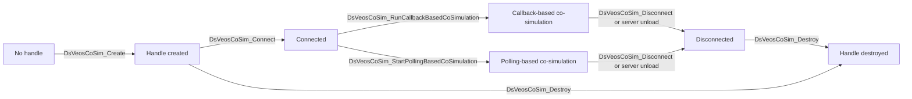

# Client Lifecycle

> [⬆️ Go to Guides](guides.md)

- [Client Lifecycle](#client-lifecycle)
  - [Overview](#overview)
  - [Recommended Flow](#recommended-flow)
  - [State Diagram](#state-diagram)
  - [Callback-Based Mode](#callback-based-mode)
  - [Polling-Based Mode](#polling-based-mode)
  - [Important Rules](#important-rules)

## Overview

The DsVeosCoSim client API follows a simple handle-based lifecycle:

1. Create a handle.
2. Connect the handle to a VEOS CoSim server.
3. Run either a callback-based or a polling-based co-simulation.
4. Exchange data during the simulation.
5. Disconnect.
6. Destroy the handle.

## Recommended Flow

```text
Create -> Connect -> Choose mode -> Exchange data -> Disconnect -> Destroy
```

## State Diagram



## Callback-Based Mode

Use [DsVeosCoSim_RunCallbackBasedCoSimulation](../api-reference/functions/DsVeosCoSim_RunCallbackBasedCoSimulation.md) if your application logic fits naturally into library callbacks.

- The function blocks until the client disconnects or the server terminates the session.
- Register callbacks in [DsVeosCoSim_Callbacks](../api-reference/structures/DsVeosCoSim_Callbacks.md) before starting the simulation.
- If the co-simulation stops normally, the function returns [DsVeosCoSim_Result_Disconnected](../api-reference/enumerations/DsVeosCoSim_Result.md).

## Polling-Based Mode

Use [DsVeosCoSim_StartPollingBasedCoSimulation](../api-reference/functions/DsVeosCoSim_StartPollingBasedCoSimulation.md) if your application already owns the main loop.

After startup, use the following sequence repeatedly:

1. Call [DsVeosCoSim_PollCommand](../api-reference/functions/DsVeosCoSim_PollCommand.md).
2. Process the returned command.
3. Call [DsVeosCoSim_FinishCommand](../api-reference/functions/DsVeosCoSim_FinishCommand.md).

If you call `PollCommand` twice in a row without `FinishCommand`, the client reports an error. If you call `FinishCommand` without a preceding `PollCommand`, the client reports an error as well.

## Important Rules

- Select either callback-based mode or polling-based mode after connecting. Do not switch mode on the same connection.
- Disconnect before destroying the handle if a co-simulation is currently active.
- After a disconnect, reacquire dynamic data such as signal lists or controller lists when you connect again.
- Use [DsVeosCoSim_SetNextSimulationTime](../api-reference/functions/DsVeosCoSim_SetNextSimulationTime.md) only to influence step scheduling during an active co-simulation.
- If you want to change execution mode, disconnect first and then reconnect before starting the new mode.
